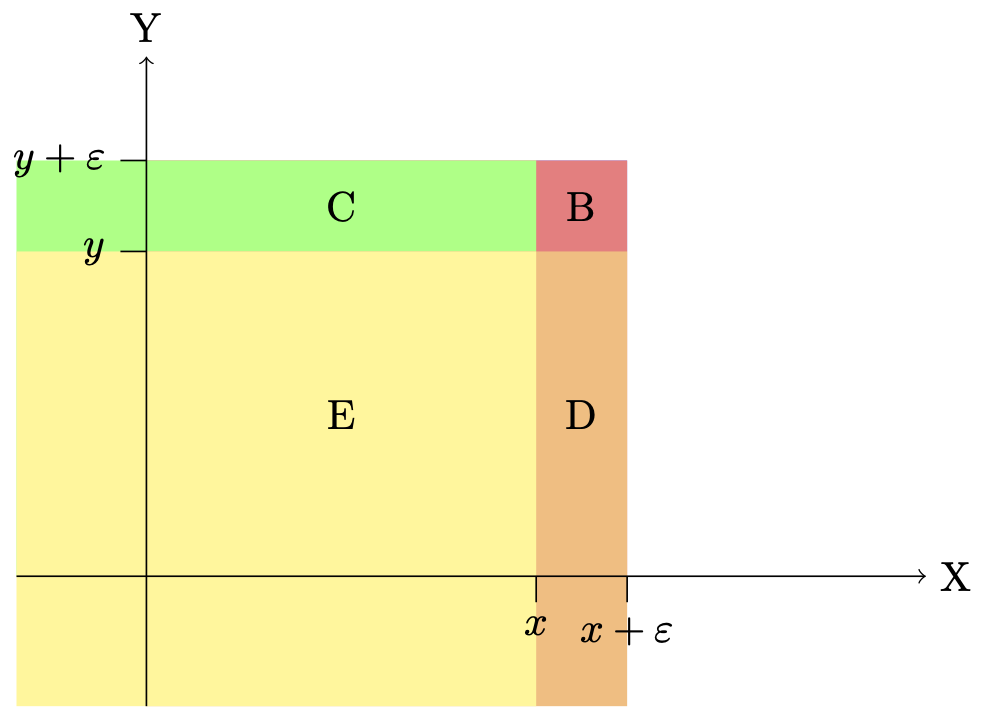

# Basic statistical results {#Basics}

How can we combine information about different groups, update a probability after observing a signal, or judge the quality of an estimator? These questions recur throughout econometrics. This chapter develops the probability tools needed to answer them.

**Prerequisites.** Basic probability, differentiation, and integration. For a Bernoulli variable with success probability $p$, recall that the mean is $p$ and the variance is $p(1-p)$.

**After working through this chapter, you should be able to:**

- Move between joint, marginal, and conditional probabilities.
- Use densities and distribution functions to calculate probabilities.
- Apply iterated expectations and decompose variance into within-group and between-group components.
- Distinguish bias, variance, mean squared error, and consistency.

The exercises in Section \@ref(basics-exercises) develop these skills through calculations, proofs, and statements to assess. Each exercise links back to the relevant section.

## Expectations, covariance, and conditional probabilities {#basics-moments}

For random variables with finite second moments,
$$
\operatorname{Var}(X)=\mathbb{E}[(X-\mathbb{E}(X))^2],\qquad
\operatorname{Cov}(X,Y)=\mathbb{E}[(X-\mathbb{E}(X))(Y-\mathbb{E}(Y))].
$$
Expectation is linear: $\mathbb{E}(a+bX+cY)=a+b\mathbb{E}(X)+c\mathbb{E}(Y)$ for constants $a,b,c$. Independence is not required. If $X$ and $Y$ are independent, their covariance is zero; the converse does not hold in general.

For discrete random variables, marginal probabilities are obtained by summing joint probabilities. For example,
$$
\mathbb{P}(X=x)=\sum_y\mathbb{P}(X=x,Y=y).
$$
Independence means $\mathbb{P}(X=x,Y=y)=\mathbb{P}(X=x)\mathbb{P}(Y=y)$ for every pair of possible values.

**Practice:** Exercise \@ref(exr:basics-covariance) develops two useful covariance identities.

### Bayes' rule {#basics-bayes}

For events $A$ and $C$ with $\mathbb{P}(C)>0$,
$$
\mathbb{P}(A\mid C)=\frac{\mathbb{P}(A\cap C)}{\mathbb{P}(C)}.
$$
If $0<\mathbb{P}(A)<1$, splitting the population into $A$ and its complement $A^c$ yields
$$
\mathbb{P}(A\mid C)=
\frac{\mathbb{P}(C\mid A)\mathbb{P}(A)}
{\mathbb{P}(C\mid A)\mathbb{P}(A)+\mathbb{P}(C\mid A^c)\mathbb{P}(A^c)}.
$$
The distinction between $\mathbb{P}(C\mid A)$ and $\mathbb{P}(A\mid C)$ is essential: the accuracy of a signal does not by itself tell us the probability of an underlying event after observing that signal.

**Practice:** Exercises \@ref(exr:basics-bayes) and \@ref(exr:basics-joint-probabilities) apply conditioning to a screening system and a joint probability table.


## Cumulative distribution and probability density functions {#basics-densities}

::: {.definition #cdf name="Cumulative distribution function (c.d.f.)"}
The random variable (r.v.) $X$ admits the cumulative distribution function $F$ if, for all $a$:
$$
F(a)=\mathbb{P}(X \le a).
$$
:::

::: {.definition #pdf name="Probability density function (p.d.f.)"}
A continuous random variable $X$ admits the probability density function $f$ if, for all $a$ and $b$ such that $a<b$:
$$
\mathbb{P}(a < X \le b) = \int_{a}^{b}f(x)dx,
$$
where $f(x) \ge 0$ for all $x$.
:::


In particular, we have:
\begin{equation}
f(x) = \lim_{\varepsilon \rightarrow 0} \frac{\mathbb{P}(x < X \le x + \varepsilon)}{\varepsilon} = \lim_{\varepsilon \rightarrow 0} \frac{F(x + \varepsilon)-F(x)}{\varepsilon}.(\#eq:flim)
\end{equation}
and
$$
F(a) = \int_{-\infty}^{a}f(x)dx.
$$
This [web interface](https://jrenne.shinyapps.io/density/) illustrates the link between p.d.f. and c.d.f. Nonparametric estimates of p.d.f. are obtained by kernel-based methods (see this [extra material](https://www.dropbox.com/s/lxkllp9yewh98d8/Additional_Kernel.pdf?dl=0)).


::: {.definition #jointcdf name="Joint cumulative distribution function (c.d.f.)"}
The random variables $X$ and $Y$ admit the joint cumulative distribution function $F_{XY}$ if, for all $a$ and $b$:
$$
F_{XY}(a,b)=\mathbb{P}(X \le a,Y \le b).
$$
:::


````{r essai3d2, fig.cap="The volume between the horizontal plane ($z=0$) and the surface is equal to $F_{XY}(0.5,1)=\\mathbb{P}(X<0.5,Y<1)$.", fig.asp = .6, out.width = "95%", fig.align = "left",echo=FALSE,warning=FALSE}


norm.density <- function(x,y,Sigma){
  det.Sigma <- det(Sigma)
  n.x <- length(x)
  n.y <- length(y)
  mat.X <- matrix(x,n.x,n.y)
  mat.Y <- t(matrix(y,n.y,n.x))
  f <- 1/(2*pi)/det.Sigma^{1/2}*exp(- (Sigma[1,1]*mat.X^2+Sigma[2,2]*mat.Y^2+2*Sigma[1,2]*(mat.X*mat.Y))/2)
  return(f)
}

require(grDevices) # for trans3d
## More examples in  demo(persp) !!
##                   -----------

# (1) The Obligatory Mathematical surface.
#     Rotated sinc function.
Sigma <- matrix(c(1,0,0,1),2,2)
x <- seq(-3, 3, by=.1)
y <- x
z <- norm.density(x,y,Sigma)

n <- length(x)
mat.X <- matrix(x,n,n)
mat.Y <- t(mat.X)

max.x <- max(x)
min.x <- min(x)
min.y <- min(y)
max.y <- max(y)
ltype <- 2

x.val <- .5
y.val <- 1

mat.X.mod <- mat.X
mat.X.mod[mat.X > x.val] <- NaN
mat.X.mod[!is.na(mat.X.mod)] <- 1
mat.Y.mod <- mat.Y
mat.Y.mod[mat.Y > y.val] <- NaN
mat.Y.mod[!is.na(mat.Y.mod)] <- 1

par(plt=c(.1,.9,.1,.9))
persp(x, y, z*mat.X.mod*mat.Y.mod, theta = 120, phi = 20, expand = 0.5, col = "lightblue",
      ltheta = 120, shade = 0.75, ticktype = "detailed",
      xlab = "X", ylab = "Y", zlab = "joint density",border=NA,xlim=c(range(x)),ylim=c(range(y)),zlim=c(range(z))
) -> res

lines(trans3d(x=c(x.val,x.val), y = c(y.val,y.val),
              z = c(0,norm.density(x=x.val,y=y.val,Sigma)), pmat = res),
      lty=1,col="red",lwd=1)
lines(trans3d(x=c(max(x),min(x)), y = c(y.val,y.val),
              z = c(0,0), pmat = res),
      lty=ltype,col="red",lwd=1)
lines(trans3d(x=c(x.val,x.val), y = c(min(y),max(y)),
              z = c(0,0), pmat = res),
      lty=ltype,col="red",lwd=1)

````


::: {.definition #jointpdf name="Joint probability density function (p.d.f.)"}
The continuous random variables $X$ and $Y$ admit the joint p.d.f. $f_{XY}$, where $f_{XY}(x,y) \ge 0$ for all $x$ and $y$, if:
$$
\mathbb{P}(a < X \le b,c < Y \le d) = \int_{a}^{b}\int_{c}^{d}f_{XY}(x,y)dy dx, \quad \forall a \le b,\;c \le d.
$$
:::

In particular, we have:
\begin{eqnarray*}
&&f_{XY}(x,y)\\
&=& \lim_{\varepsilon \rightarrow 0} \frac{\mathbb{P}(x < X \le x + \varepsilon,y < Y \le y + \varepsilon)}{\varepsilon^2} \\
&=& \lim_{\varepsilon \rightarrow 0} \frac{F_{XY}(x + \varepsilon,y + \varepsilon)-F_{XY}(x,y + \varepsilon)-F_{XY}(x + \varepsilon,y)+F_{XY}(x,y)}{\varepsilon^2}.
\end{eqnarray*}


```{r essai3d, fig.cap="Assume that the basis of the black column is defined by those points whose $x$-coordinates are between $x$ and $x+\\varepsilon$ and $y$-coordinates are between $y$ and $y+\\varepsilon$. Then the volume of the black column is equal to $\\mathbb{P}(x < X \\le x+\\varepsilon,y < Y \\le y+\\varepsilon)$, which is approximately equal to $f_{XY}(x,y)\\varepsilon^2$ if $\\varepsilon$ is small.", fig.asp = .6, out.width = "95%", fig.align = "left",echo=FALSE,warning=FALSE}

norm.density <- function(x,y,Sigma){
  det.Sigma <- det(Sigma)
  n.x <- length(x)
  n.y <- length(y)
  mat.X <- matrix(x,n.x,n.y)
  mat.Y <- t(matrix(y,n.y,n.x))
  f <- 1/(2*pi)/det.Sigma^{1/2}*exp(- (Sigma[1,1]*mat.X^2+Sigma[2,2]*mat.Y^2+2*Sigma[1,2]*(mat.X*mat.Y))/2)
  return(f)
}

require(grDevices) # for trans3d
## More examples in  demo(persp) !!
##                   -----------

# (1) The Obligatory Mathematical surface.
#     Rotated sinc function.
Sigma <- matrix(c(1,0,0,1),2,2)
x <- seq(-3, 3, by=.1)
y <- x
z <- norm.density(x,y,Sigma)

n <- length(x)
mat.X <- matrix(x,n,n)
mat.Y <- t(mat.X)

op <- par(bg = "white")
par(plt=c(.1,.9,.1,.9))
persp(x, y, z, theta = 30, phi = 30, expand = 0.5, col = "lightblue",
      ltheta = 120, shade = 0.75, ticktype = "detailed",
      xlab = "X", ylab = "Y", zlab = "joint density",border=NA,xlim=c(range(x)),ylim=c(range(y)),zlim=c(range(z))
) -> res
all.x <- c(.4,.4,.5,.5)
all.y <- -c(.4,.5,.4,.5)
for(i in 1:4){
  if(i==1){
    ltype <- 3
  }else{ltype <- 1}
  lines(trans3d(x=c(all.x[i],all.x[i]), y = c(all.y[i],all.y[i]),
                z = c(0,norm.density(x=all.x[i],y=all.y[i],Sigma)), pmat = res),
        lty=ltype,col="black",lwd=1)
}
par(new=TRUE)
par(plt=c(.1,.9,.1,.9))
all.x <- sort(all.x[c(1,4)])
all.y <- sort(all.y[c(1,4)])
persp(x=all.x, y=all.y, norm.density(x=all.x,y=all.y,Sigma),
      theta = 30, phi = 30, expand = 0.5, col = "black",
      ltheta = 120, shade = 0.75, ticktype = "detailed",
      xlab = "", ylab = "", zlab = "",border="black",lwd=2,xlim=c(range(x)),ylim=c(range(y)),zlim=c(range(z))
)
par(new=TRUE)
par(plt=c(.1,.9,.1,.9))
persp(x=all.x, y=all.y, 0*norm.density(x=all.x,y=all.y,Sigma),
      theta = 30, phi = 30, expand = 0.5, col = "black",
      ltheta = 120, shade = 0.75, ticktype = "detailed",
      xlab = "", ylab = "", zlab = "",border="black",lwd=2,xlim=c(range(x)),ylim=c(range(y)),zlim=c(range(z))
)

max.x <- max(x)
min.x <- min(x)
min.y <- min(y)
max.y <- max(y)
ltype <- 2
lines(trans3d(x=c(min(all.x),min(all.x)), y = c(min.y,max.y),
              z = c(0,0), pmat = res),col="blue",lwd=1,lty=ltype)
lines(trans3d(x=c(max(all.x),max(all.x)), y = c(min.y,max.y),
              z = c(0,0), pmat = res),col="blue",lwd=1,lty=ltype)
lines(trans3d(x=c(min.x,max.x), y = c(min(all.y),min(all.y)),
              z = c(0,0), pmat = res),col="blue",lwd=1,lty=ltype)
lines(trans3d(x=c(min.x,max.x), y = c(max(all.y),max(all.y)),
              z = c(0,0), pmat = res),col="blue",lwd=1,lty=ltype)

```


Figure \@ref(fig:figFXYdecompo) illustrates why we have
\begin{eqnarray*}
&&\mathbb{P}(x < X \le x + \varepsilon,y < Y \le y + \varepsilon)\\
&=& F_{XY}(x + \varepsilon,y + \varepsilon)-F_{XY}(x,y + \varepsilon)-F_{XY}(x + \varepsilon,y)+F_{XY}(x,y).
\end{eqnarray*}
Let us denote by $P_\Omega$ the probability that the point of coordinate $(X,Y)$ is included in the $\Omega$ area. We have:
$$
P_{B} = P_{B+C+D+E} - P_{E+D} - P_{E+C} + P_E,
$$
which implies that
\begin{eqnarray*}
&&\mathbb{P}(x<X\le x+ \varepsilon,y<Y\le y+ \varepsilon) \\
&=& \mathbb{P}(X\le x+ \varepsilon,Y\le y+ \varepsilon)  - \mathbb{P}(X\le x+ \varepsilon,Y\le y)  - \mathbb{P}(X\le x,Y\le y+ \varepsilon)\\
&&+ \mathbb{P}(X\le x,Y\le y).
\end{eqnarray*}

```{r figFXYdecompo, fig.align = 'center', out.width = "80%", fig.cap = "Area $B+C+D+E$ encompasses the points with coordinates $(X,Y)$ such that $X\\le x+\\varepsilon$ and $Y \\le y + \\varepsilon$. Area $D+E$ encompasses the points with coordinates $(X,Y)$ such that $X\\le x+\\varepsilon$ and $Y \\le y$. Area $C+E$ encompasses the points with coordinates $(X,Y)$ such that $X\\le x$ and $Y \\le y + \\varepsilon$.", echo=FALSE}

```


:::{.definition #condcdf name="Conditional probability distribution function"}
If $X$ and $Y$ are continuous r.v., then the distribution of $X$ conditional on $Y=y$, which we denote by $f_{X|Y}(x,y)$, satisfies:
$$
f_{X|Y}(x,y)=\lim_{\varepsilon \rightarrow 0} \frac{\mathbb{P}(x < X \le x + \varepsilon|Y=y)}{\varepsilon}.
$$
:::


:::{.proposition #condcdf name="Conditional probability distribution function"}
We have
$$
f_{X|Y}(x,y)=\frac{f_{XY}(x,y)}{f_Y(y)}.
$$
:::
:::{.proof}
We have:
\begin{eqnarray*}
f_{X|Y}(x,y)&=&\lim_{\varepsilon \rightarrow 0} \frac{\mathbb{P}(x < X \le x + \varepsilon|Y=y)}{\varepsilon}\\
&=&\lim_{\varepsilon \rightarrow 0} \frac{1}{\varepsilon}\mathbb{P}(x < X \le x + \varepsilon|y<Y\le y+\varepsilon)\\
&=&\lim_{\varepsilon \rightarrow 0} \frac{1}{\varepsilon}\frac{\mathbb{P}(x < X \le x + \varepsilon,y<Y\le y+\varepsilon)}{\mathbb{P}(y<Y\le y+\varepsilon)}\\
&=&\lim_{\varepsilon \rightarrow 0} \frac{1}{\varepsilon} \frac{\varepsilon^2f_{XY}(x,y)}{\varepsilon f_{Y}(y)}.
\end{eqnarray*}
:::

:::{.definition #independent name="Independent random variables"}
Consider two r.v., $X$ and $Y$, with respective c.d.f. $F_X$ and $F_Y$, and respective p.d.f. $f_X$ and $f_Y$.

These random variables are independent if and only if (iff) the joint c.d.f. of $X$ and $Y$ (see Def. \@ref(def:jointcdf)) is given by:
$$
F_{XY}(x,y) = F_{X}(x) \times F_{Y}(y),
$$
or, equivalently, iff the joint p.d.f. of $(X,Y)$ (see Def. \@ref(def:jointpdf)) is given by:
$$
f_{XY}(x,y) = f_{X}(x) \times f_{Y}(y).
$$
:::


We have the following:

1. If $X$ and $Y$ are independent, $f_{X|Y}(x,y)=f_{X}(x)$. This implies, in particular, that $\mathbb{E}(g(X)|Y)=\mathbb{E}(g(X))$, where $g$ is any function.
2. If $X$ and $Y$ are independent, then $\mathbb{E}(g(X)h(Y))=\mathbb{E}(g(X))\mathbb{E}(h(Y))$ and $\mathbb{C}ov(g(X),h(Y))=0$, where $g$ and $h$ are any functions.

It is important to note that the absence of correlation between two variables is not a sufficient condition to have independence. Consider for instance the case where $X=Y^2$, with $Y \sim\mathcal{N}(0,1)$. In this case, we have $\mathbb{C}ov(X,Y)=0$, but $X$ and $Y$ are not independent. Indeed, we have for instance $\mathbb{E}(Y^2 \times X)=3$, which is not equal to $\mathbb{E}(Y^2) \times \mathbb{E}(X)=1$. (If $X$ and $Y$ were independent, we should have $\mathbb{E}(Y^2 \times X)=\mathbb{E}(Y^2) \times \mathbb{E}(X)$ according to point 2 above.)

**Practice:** Exercise \@ref(exr:basics-quantiles) asks how a density changes after conditioning above a quantile.

## Law of iterated expectations {#basics-iterated-expectations}

:::{.proposition #lawiteratedexpect name="Law of iterated expectations"}
If $X$ and $Y$ are two random variables and if $\mathbb{E}(|X|)<\infty$, we have:
$$
\boxed{\mathbb{E}(X) = \mathbb{E}(\mathbb{E}(X|Y)).}
$$
:::
:::{.proof}
(in the case where the p.d.f. of $(X,Y)$ exists) Let us denote by $f_X$, $f_Y$ and $f_{XY}$ the probability distribution functions (p.d.f.) of $X$, $Y$ and $(X,Y)$, respectively. We have:
$$
f_{X}(x) = \int f_{XY}(x,y) dy.
$$
Besides, we have (Bayes equality, Prop. \@ref(prp:condcdf)):
$$
f_{XY}(x,y) = f_{X|Y}(x,y)f_{Y}(y).
$$
Therefore:
\begin{eqnarray*}
\mathbb{E}(X) &=& \int x f_X(x)dx = \int x  \underbrace{ \int  f_{XY}(x,y) dy}_{=f_X(x)} dx =\int  \int x f_{X|Y}(x,y)f_{Y}(y) dydx \\
& = & \int \underbrace{\left(\int x f_{X|Y}(x,y)dx\right)}_{\mathbb{E}[X|Y=y]}f_{Y}(y) dy = \mathbb{E} \left( \mathbb{E}[X|Y] \right).
\end{eqnarray*}
:::


:::{.example #mixture name="Mixture of Gaussian distributions"}
By definition, $X$ is drawn from a mixture of Gaussian distributions if:
$$
X = \color{blue}{B \times Y_1} + \color{red}{(1-B) \times Y_2},
$$
where $B$, $Y_1$ and $Y_2$ are three independent variables drawn as follows:
$$
B \sim \mbox{Bernoulli}(p),\quad Y_1 \sim \mathcal{N}(\mu_1,\sigma_1^2), \quad \mbox{and}\quad Y_2 \sim \mathcal{N}(\mu_2,\sigma_2^2).
$$

Figure \@ref(fig:mixtureG) displays the pdfs associated with three different mixtures of Gaussian distributions. (This [web-interface](https://jrenne.shinyapps.io/density/) allows to produce the pdf associated for any other parameterization.)

```{r mixtureG, fig.cap="Example of pdfs of mixtures of Gaussian distribututions.", fig.asp = .6, out.width = "95%", fig.align = "left",echo=FALSE,warning=FALSE}
x <- seq(-5,5,by=.1)
par(mfrow=c(1,3))
par(plt=c(.1,.9,.1,.8))
p <- .5
mu.1 <- -1
sigma.1 <- 1
mu.2 <- 2
sigma.2 <- 1
plot(x,p*dnorm(x,mean = mu.1,sd=sigma.1)+(1-p)*dnorm(x,mean = mu.2,sd=sigma.2),
     type="l",lwd=2,
     main=expression(paste(p,"=0.5, ",mu[1],"=-1, ",sigma[1],"=1, ",mu[2],"=2, ",sigma[2],"=1, ",sep="")),
     xlab="",ylab="")
lines(x,p*dnorm(x,mean = mu.1,sd=sigma.1),col="red",lwd=2,lty=3)
lines(x,(1-p)*dnorm(x,mean = mu.2,sd=sigma.2),col="blue",lwd=2,lty=3)
p <- .1
mu.1 <- -2
sigma.1 <- .5
mu.2 <- 2
sigma.2 <- 1
plot(x,p*dnorm(x,mean = mu.1,sd=sigma.1)+(1-p)*dnorm(x,mean = mu.2,sd=sigma.2),
     type="l",lwd=2,
     main=expression(paste(p,"=0.1, ",mu[1],"=-2, ",sigma[1],"=0.5, ",mu[2],"=2, ",sigma[2],"=1, ",sep="")),
     xlab="",ylab="")
lines(x,p*dnorm(x,mean = mu.1,sd=sigma.1),col="red",lwd=2,lty=3)
lines(x,(1-p)*dnorm(x,mean = mu.2,sd=sigma.2),col="blue",lwd=2,lty=3)
p <- .3
mu.1 <- -2
sigma.1 <- 2
mu.2 <- 1
sigma.2 <- 1
plot(x,p*dnorm(x,mean = mu.1,sd=sigma.1)+(1-p)*dnorm(x,mean = mu.2,sd=sigma.2),
     type="l",lwd=2,
     main=expression(paste(p,"=0.3, ",mu[1],"=-2, ",sigma[1],"=2, ",mu[2],"=1, ",sigma[2],"=1, ",sep="")),
     xlab="",ylab="")
lines(x,p*dnorm(x,mean = mu.1,sd=sigma.1),col="red",lwd=2,lty=3)
lines(x,(1-p)*dnorm(x,mean = mu.2,sd=sigma.2),col="blue",lwd=2,lty=3)
```


The law of iterated expectations gives:
$$
\mathbb{E}(X) = \mathbb{E}(\mathbb{E}(X|B)) = \mathbb{E}(B\mu_1+(1-B)\mu_2)=p\mu_1 + (1-p)\mu_2.
$$
:::


:::{.example #Buffon name="Buffon (1733)'s needles"}

Suppose we have a floor made of parallel strips of wood, each the same width [$w=1$]. We drop a needle, of length $1/2$, onto the floor. What is the probability that the needle crosses the grooves of the floor?

Let's define the random variable $X$ by
$$
X = \left\{
\begin{array}{cl}
1 & \mbox{if the needle crosses a line}\\
0 & \mbox{otherwise.}
\end{array}
\right.
$$
Conditionally on $\theta$, it can be seen that we have $\mathbb{E}(X|\theta)=\cos(\theta)/2$ (see Figure \@ref(fig:Buffon)).

```{r Buffon, fig.cap="Schematic representation of the problem.", fig.asp = .6, out.width = "95%", fig.align = "left",echo=FALSE,warning=FALSE}
par(mfrow=c(1,1))
par(plt=c(.25,.75,.1,.8))
plot(0,0,col="white",xlim=c(-.1,1.1),ylim=c(-.1,0.6),xlab="",ylab="",xaxt="n",yaxt="n")
abline(v=0,lwd=3,col="brown")
abline(v=1,lwd=2,col="brown")
theta <- pi/5
x0=.2
y0=.2
lines(c(x0,x0+cos(theta)/2),c(y0,y0+sin(theta)/2),col="red",lwd=3)
abline(h=y0,col="grey")
text(x0+.1,y0+.05,expression(paste("angle ",theta,sep="")),pos=4)
arrows(x0=0, y0=y0, x1 = x0, y1 = y0, length = 0.1, angle = 30,
       code = 3,lwd=2)
text(x0/2,y0+.02,"d")
arrows(x0=0, y0=0, x1 = 1, y1 = 0, length = 0.1, angle = 30,
       code = 3,lwd=2)
text(1/2,0+.02,"w=1")
```

It is reasonable to assume that $\theta$ is uniformly distributed on $[-\pi/2,\pi/2]$, therefore:
$$
\mathbb{E}(X)=\mathbb{E}(\mathbb{E}(X|\theta))=\mathbb{E}(\cos(\theta)/2)=\int_{-\pi/2}^{\pi/2}\frac{1}{2}\cos(\theta)\left(\frac{d\theta}{\pi}\right)=\frac{1}{\pi}.
$$

[This [web-interface](https://jrenne.shinyapps.io/StatEcoII/) allows to simulate the present experiment (select Worksheet "Buffon's needles").]

:::


<!-- \begin{exmpl}[Davis and Lo's (2001) model] -->
<!-- \href{http://www.tandfonline.com/doi/abs/10.1080/713665832}{Davis and Lo (2001)} introduce a contagion model and propose applications in terms of credit-risk management. -->

<!-- \vspace{.2cm} -->
<!-- They consider $n$ entities. The state of entity $i$ is denoted by $d_i$: $d_i=0$ if entity $i$ stays non-infected and $1$ if it gets infected. There are two ways of getting infected: -->
<!-- \begin{itemize} -->
<!-- 	\item direct, or autonomous, infection; -->
<!-- 	\item indirect infection, or contamination. -->
<!-- \end{itemize} -->

<!-- \vspace{.2cm} -->
<!-- Direct infection and contamination are modelled through two types of random variables: $X_i$s ($n$ of them) and $Y_{ji}$s ($n^2$ of them). These $n(n+1)$ variables are independently Bernoulli distributed. The Bernoulli parameter is $p$ for the $X_i$s and $q$ for the $Y_{ji}$s. We have: -->
<!-- $$ -->
<!-- d_i = \underbrace{X_i}_{\mbox{autonomous infection}} + (1 - X_i) \underbrace{\left(1 - \prod_{j \ne i}(1 - X_jY_{ji})\right)}_{\mbox{contamination}}. -->
<!-- $$ -->
<!-- In order to determine the distribution of the number of infected entities, it is convenient to first reason conditionally on the number of autonomous infections $r$ defined by $r=\sum_i X_i $. \href{https://jrenne.shinyapps.io/StatEcoII/}{\beamergotobutton{Web-interface illustration}} -->
<!-- \end{exmpl} -->


**Practice:** Exercise \@ref(exr:basics-random-bernoulli) distinguishes conditional and unconditional moments.

## Law of total variance {#basics-total-variance}

:::{.proposition #lawtotalvariance name="Law of total variance"}

If $X$ and $Y$ are two random variables and if the variance of $X$ is finite, we have:
$$
\boxed{\mathbb{V}ar(X) = \mathbb{E}(\mathbb{V}ar(X|Y)) + \mathbb{V}ar(\mathbb{E}(X|Y)).}
$$
:::
:::{.proof}
We have:
\begin{eqnarray*}
\mathbb{V}ar(X) &=& \mathbb{E}(X^2) - \mathbb{E}(X)^2\\
&=& \mathbb{E}(\mathbb{E}(X^2|Y)) - \mathbb{E}(X)^2\\
&=& \mathbb{E}(\mathbb{E}(X^2|Y) \color{blue}{- \mathbb{E}(X|Y)^2}) +  \color{blue}{\mathbb{E}(\mathbb{E}(X|Y)^2)}  - \color{red}{\mathbb{E}(X)^2}\\
&=& \mathbb{E}(\underbrace{\mathbb{E}(X^2|Y) - \mathbb{E}(X|Y)^2}_{\mathbb{V}ar(X|Y)}) + \underbrace{\mathbb{E}(\mathbb{E}(X|Y)^2) - \color{red}{\mathbb{E}(\mathbb{E}(X|Y))^2}}_{\mathbb{V}ar(\mathbb{E}(X|Y))}.
\end{eqnarray*}
:::


:::{.example #mixture2 name="Mixture of Gaussian distributions (cont'd)"}

Consider the case of a mixture of Gaussian distributions (Example \@ref(exm:mixture)). We have:
\begin{eqnarray*}
\mathbb{V}ar(X) &=& \color{blue}{\mathbb{E}(\mathbb{V}ar(X|B))} + \color{red}{\mathbb{V}ar(\mathbb{E}(X|B))}\\
&=&  \color{blue}{p\sigma_1^2+(1-p)\sigma_2^2} + \color{red}{p(1-p)(\mu_1 - \mu_2)^2}.
\end{eqnarray*}
:::


<!-- \end{footnotesize} -->

**Practice:** Exercise \@ref(exr:basics-total-variance) separates within-group and between-group variation.

## Bias, accuracy, and consistency {#basics-estimators}

Let $\widehat\theta$ estimate a fixed parameter $\theta$. Its **bias** is $\mathbb{E}(\widehat\theta)-\theta$; an unbiased estimator has zero bias. When its second moment is finite, its **mean squared error** satisfies
$$
\operatorname{MSE}(\widehat\theta)=\mathbb{E}[(\widehat\theta-\theta)^2]
=\operatorname{Var}(\widehat\theta)+\operatorname{Bias}(\widehat\theta)^2.
$$
A small variance means the estimator is concentrated around its own mean; it does not guarantee that this mean is close to the parameter. Exercise \@ref(exr:basics-estimator-properties) derives this decomposition. Consistency concerns a different question: what happens as the sample grows?

The objective of econometrics is to estimate parameters out of data observations (samples). Examples of parameters of interest include, among many others: causal effect of a variable on another, elasticities, parameters defining some distribution of interest, preference parameters (risk aversion)...

Except in degenerate cases, the estimates are different from the "true" (or *population*) value. A good estimator is expected to converge to the true value when the sample size increases. That is, we are interested in the *consistency* of the estimator.

Denote by $\hat\theta_n$ the estimate of $\theta$ based on a sample of length $n$. We say that $\hat\theta$ is a consistent estimator of $\theta$ if, for any $\varepsilon>0$ (even if very small), the probability that $\hat\theta_n$ is in $[\theta - \varepsilon,\theta + \varepsilon]$ goes to 1 when $n$ goes to $\infty$. Formally:
$$
\lim_{n \rightarrow + \infty} \mathbb{P}\left(\hat\theta_n \in [\theta - \varepsilon,\theta + \varepsilon]\right) = 1.
$$

That is, $\hat\theta$ is a consistent estimator if $\hat\theta_n$ *converges in probability* (Def. \@ref(def:convergenceproba)) to $\theta$. Note that there exist different types of stochastic convergence.^[Appendix \@ref(StochConvergences) notably provides the definitions of the convergence in distribution (Def. \@ref(def:cvgceDistri)) and the mean-square convergence (Def. \@ref(def:convergenceLr)).]

:::{.example #NonConsist name="Example of non-convergent estimator"}

Assume that $X_i \sim i.i.d. \mbox{Cauchy}$ with a location parameter of 1 and a scale parameter of 1 (Def. \@ref(def:Cauchy)). The sample mean $\bar{X}_n = \frac{1}{n}\sum_{i=1}^{n} X_i$ does not converge in probability. This is because a Cauchy distribution has no mean; hence the law of large numbers (Theorem \@ref(thm:LLN)) does not apply.

```{r figCauchy, fig.cap="Simulation of $\\bar{X}_n$ when $X_i \\sim i.i.d. \\mbox{Cauchy}$.", fig.asp = .6, out.width = "95%", fig.align = "left",warning=FALSE}
N <- 5000
X <- rcauchy(N, location=1)
X.bar <- cumsum(X)/(1:N)
par(plt=c(.1,.95,.3,.85),mfrow=c(1,2))
plot(X,type="l",xlab="sample size (n)",
     ylab="",main=expression(X[n]),lwd=2)
plot(X.bar,type="l",xlab="sample size (n)",
     ylab="",main=expression(bar(X)[n]),lwd=2)
abline(h=1,lty=2,col="grey")
```
:::

## Chapter recap {-}

- A conditional probability changes the information available; Bayes' rule reverses the direction of conditioning.
- A density gives probabilities through integration, not through its value at a single point.
- Iterated expectations recover a population mean by averaging conditional means.
- Total variance adds average within-group variance and variance between group means.
- Bias and variance describe finite-sample performance; consistency describes behavior as sample size increases.

```{r basics-exercise-pagebreak, echo=FALSE, results='asis'}
if (knitr::is_latex_output()) cat("\\clearpage\n")
```

## Exercises {#basics-exercises}

Attempt each question before class and explain your reasoning, including for the true-or-false statements. **Foundation** exercises apply a result directly; **Standard** exercises require several steps or a short proof. Worked solutions and exercise-specific hints are reserved for teaching sessions and are not included in this student edition.

```{r basics-exercise-bank, echo=FALSE, results='asis'}
source("R/exercises.R")
render_exercises("basics")
```
