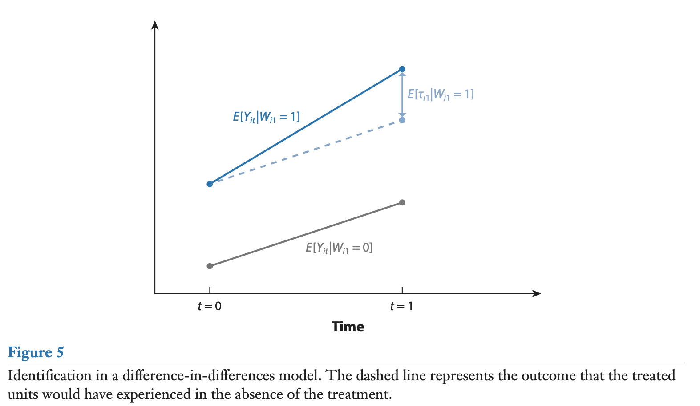
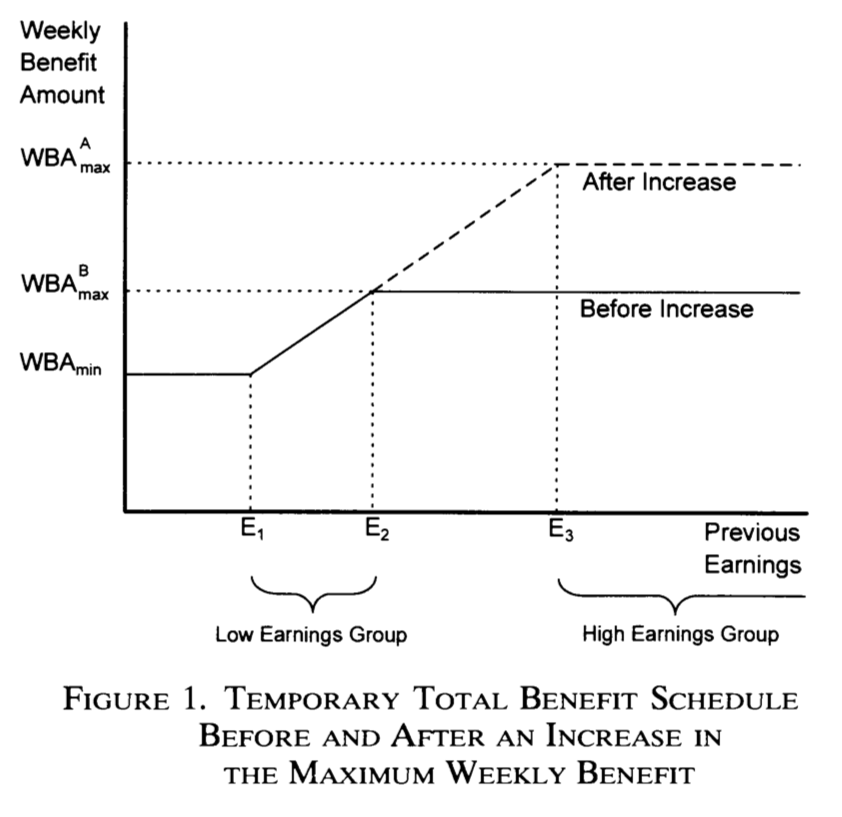

# Panel regressions {#Panel}

**Prerequisites.** Linear regression, omitted-variable bias, generalized least squares, instrumental variables, and hypothesis testing.

**After working through this chapter, you should be able to:**

- Recognize the structure of a panel dataset and distinguish pooled, fixed-effects, and random-effects models.
- Derive and interpret the within estimator.
- Explain when random-effects estimation is consistent and how it differs from fixed effects.
- Identify the source of bias in dynamic panel regressions and the role of internal instruments.
- State the identifying assumption behind difference-in-differences.

**Roadmap.** The chapter introduces panel notation and the main assumptions before presenting fixed-effects and random-effects estimators. It then studies dynamic panels and closes with programme-evaluation methods. Section \@ref(panel-exercises) applies these ideas.

## Specification and notations

A panel dataset follows the same entities across time. Entities are indexed by $i\in\{1,\dots,n\}$ and periods by $t\in\{1,\dots,T\}$. This repeated-observation structure lets us distinguish variation across entities from variation within an entity over time.

The linear panel regression model is:
\begin{equation}
y_{i,t} = \bv{x}'_{i,t}\underbrace{\boldsymbol\beta}_{K \times 1} + \underbrace{\bv{z}'_{i}\boldsymbol\alpha}_{\mbox{Individual effects}} + \varepsilon_{i,t}.(\#eq:panel1)
\end{equation}

When running panel regressions, the usual objective is to estimate $\boldsymbol\beta$.

<!-- \includegraphics[width=.95\linewidth]{../../figures/Figure_Panel_simul0.pdf} -->

Figure \@ref(fig:simulPanel) illustrates why that distinction matters. The model is $y_{i,t}=\alpha_i+\beta x_{i,t}+\varepsilon_{i,t}$ for $t\in\{1,2\}$. In Panel (b), blue and red dots represent the two periods, and each line joins observations for the same entity. The pooled correlation between $y$ and $x$ is negative, yet the within-entity relationship is positive because $\beta=5$. The entity effects $\alpha_i$ are negatively correlated with $x_{i,t}$, so ignoring the panel structure would reverse the sign of the relationship of interest.

```{r simulPanel, fig.cap="The data are the same for both panels. On Panel (b), blue dots are for $t=1$, red dots are for $t=2$. The lines relate the dots associated to the same entity $i$.", fig.asp = .6, out.width = "95%", fig.align = 'left'}
T <- 2; n <- 12 # 2 periods and 12 entities
alpha <- 5*rnorm(n) # draw fixed effects
x.1 <- rnorm(n) - .5*alpha # note: x_i's correlate to alpha_i's
x.2 <- rnorm(n) - .5*alpha
beta <- 5; sigma <- .3
y.1 <- alpha + x.1 + sigma*rnorm(n);y.2 <- alpha + x.2 + sigma*rnorm(n)
x <- c(x.1,x.2) # pooled x
y <- c(y.1,y.2) # pooled y
par(mfrow=c(1,2))
plot(x,y,col="black",pch=19,xlab="x",ylab="y",main="(a)")
plot(x,y,col="black",pch=19,xlab="x",ylab="y",main="(b)")
points(x.1,y.1,col="blue",pch=19);points(x.2,y.2,col="red",pch=19)
for(i in 1:n){lines(c(x.1[i],x.2[i]),c(y.1[i],y.2[i]))}
```

Figure \@ref(fig:cigarettes) presents the same type of plot based on the Cigarette Consumption Panel dataset (`CigarettesSW` dataset, used in @Stock_Watson_2003). This dataset documents the average consumption of cigarettes in 48 continental US states for two dates (1985 and 1995).

```{r cigarettes, fig.align = 'left', out.width = "95%", fig.cap = "Cigarette consumption versus real price in the CigarettesSW panel dataset.", echo=FALSE}
data("CigarettesSW", package = "AER")
CigarettesSW$rprice  <- with(CigarettesSW, price/cpi) # compute real price
par(plt=c(.15,.95,.2,.95))
plot(packs~rprice,data=CigarettesSW,xlim=c(70,170),ylim=c(50,200),
     subset = year == 1985,pch=19,col="blue",xlab="real price",ylab="# of packs")
points(packs~rprice,data=CigarettesSW,subset = year == 1995,pch=19,col="red")
states <- levels(CigarettesSW$state)
for(i in 1:length(states)){
  lines(packs~rprice,data=CigarettesSW,subset = state == states[i])
}
```


We will make use of the following notations:
$$
\bv{y}_i =
\underbrace{\left[
\begin{array}{c}
y_{i,1}\\
\vdots\\
y_{i,T}
\end{array}\right]}_{T \times 1}, \quad
\boldsymbol\varepsilon_i =
\underbrace{\left[
\begin{array}{c}
\varepsilon_{i,1}\\
\vdots\\
\varepsilon_{i,T}
\end{array}\right]}_{T \times 1}, \quad
\bv{x}_i =
\underbrace{\left[
\begin{array}{c}
\bv{x}_{i,1}'\\
\vdots\\
\bv{x}_{i,T}'
\end{array}\right]}_{T \times K}, \quad
\bv{X} =
\underbrace{\left[
\begin{array}{c}
\bv{x}_{1}\\
\vdots\\
\bv{x}_{n}
\end{array}\right]}_{(nT) \times K}.
$$
$$
\tilde{\bv{y}}_i =
\left[
\begin{array}{c}
y_{i,1} - \bar{y}_i\\
\vdots\\
y_{i,T} - \bar{y}_i
\end{array}\right], \quad
\tilde{\boldsymbol\varepsilon}_i =
\left[
\begin{array}{c}
\varepsilon_{i,1} - \bar{\varepsilon}_i\\
\vdots\\
\varepsilon_{i,T} - \bar{\varepsilon}_i
\end{array}\right],
$$
$$
\tilde{\bv{x}}_i =
\left[
\begin{array}{c}
\bv{x}_{i,1}' - \bar{\bv{x}}_i'\\
\vdots\\
\bv{x}_{i,T}' - \bar{\bv{x}}_i'
\end{array}\right], \quad
\tilde{\bv{X}} =
\left[
\begin{array}{c}
\tilde{\bv{x}}_{1}\\
\vdots\\
\tilde{\bv{x}}_{n}
\end{array}\right], \quad
\tilde{\bv{Y}} =
\left[
\begin{array}{c}
\tilde{\bv{y}}_{1}\\
\vdots\\
\tilde{\bv{y}}_{n}
\end{array}\right],
$$
where
$$
\bar{y}_i = \frac{1}{T} \sum_{t=1}^T y_{i,t}, \quad \bar{\varepsilon}_i = \frac{1}{T}\sum_{t=1}^T \varepsilon_{i,t} \quad \mbox{and} \quad \bar{\bv{x}}_i = \frac{1}{T}\sum_{t=1}^T \bv{x}_{i,t}.
$$


## Three standard cases

How the individual effect relates to the observed regressors determines the appropriate estimator. The following three cases separate pooled models, fixed effects, and random effects.

There are three typical situations:

* **Pooled regression**: $\bv{z}_i \equiv 1$. This case amounts to the case studied in Chapter \@ref(ChapterLS).
* **Fixed Effects** (Section \@ref(FixedEffect)): $\bv{z}_i$ is unobserved, but correlates with $\bv{x}_i$ $\Rightarrow$ $\bv{b}$ is biased and inconsistent in the OLS regression of $\bv{y}$ on $\bv{X}$ (omitted variable, see Section \@ref(Omitted)).
* **Random Effects** (Section \@ref(RandomEffect)): $\bv{z}_i$ is unobserved, but uncorrelated with $\bv{x}_i$. The model writes:
$$
y_{i,t} = \bv{x}'_{i,t}\boldsymbol\beta + \alpha +  \underbrace{{\color{blue}u_i + \varepsilon_{i,t}}}_{\mbox{compound error}},
$$
where $\alpha = \mathbb{E}(\bv{z}'_{i}\boldsymbol\alpha)$ and $u_i = \bv{z}'_{i}\boldsymbol\alpha - \mathbb{E}(\bv{z}'_{i}\boldsymbol\alpha) \perp \bv{x}_i$. In that case, the OLS is consistent, but not efficient. GLS can be used to gain efficiencies over OLS (see Section \@ref(GLS) for a presentation of the GLS approach).


## Estimation of fixed-effects models {#FixedEffect}

When individual effects may be correlated with the regressors, the estimator must remove those effects rather than treat them as part of the disturbance. The fixed-effects approaches below do so through dummy variables, within transformations, or first differences.


:::{.hypothesis #FE name="Fixed-effect model"}

We assume that:

i. There is no perfect multicollinearity among the regressors.
ii. $\mathbb{E}(\varepsilon_{i,t}|\bv{X})=0$, for all $i,t$.
iii. We have:
$$
\mathbb{E}(\varepsilon_{i,t}\varepsilon_{j,s}|\bv{X}) =
\left\{
\begin{array}{cl}
\sigma^2 & \mbox{if $i=j$ and $s=t$},\\
0 & \mbox{otherwise.}
\end{array}\right.
$$
:::


These assumptions are analogous to those introduced in the standard linear regression:

(i) $\leftrightarrow$ Hyp. \@ref(hyp:fullrank), (ii) $\leftrightarrow$ Hyp. \@ref(hyp:exogeneity), (iii) $\leftrightarrow$ Hyp. \@ref(hyp:homoskedasticity) + \@ref(hyp:noncorrelResid).


In matrix form, for a given $i$, the model writes:
$$
\bv{y}_i = \bv{x}_i \boldsymbol\beta + \bv{1}_T\alpha_i + \boldsymbol\varepsilon_i,
$$
where $\bv{1}_T$ is a $T$-dimensional vector of ones.

This is the **Least Square Dummy Variable (LSDV)** model:
\begin{equation}
\bv{y} = [\bv{X} \quad \bv{D}]
\left[
\begin{array}{c}
\boldsymbol\beta\\
\boldsymbol\alpha
\end{array}
\right]
+ \boldsymbol\varepsilon, (\#eq:LSDV)
\end{equation}
with:
$$
\bv{D} = \underbrace{ \left[\begin{array}{cccc}
\bv{1}_T&\bv{0}&\dots&\bv{0}\\
\bv{0}&\bv{1}_T&\dots&\bv{0}\\
&&\vdots&\\
\bv{0}&\bv{0}&\dots&\bv{1}_T\\
\end{array}\right]}_{(nT \times n)}.
$$

The linear regression (Eq. \@ref(eq:LSDV)) ---with the dummy variables--- satisfies the Gauss-Markov conditions (Theorem \@ref(thm:GaussMarkov)). Hence, in this context, the OLS estimator is the *best linear unbiased estimator* (BLUE).

Denoting by $\bv{Z}$ the matrix $[\bv{X} \quad \bv{D}]$, and by $\bv{b}$ and $\bv{a}$ the respective OLS estimates of $\boldsymbol\beta$ and of $\boldsymbol\alpha$, we have:
\begin{equation}
\boxed{
\left[
\begin{array}{c}
\bv{b}\\
\bv{a}
\end{array}
\right]
= [\bv{Z}'\bv{Z}]^{-1}\bv{Z}'\bv{y}.} (\#eq:bfixedeffects11)
\end{equation}

When the number of entities $n$ grows while $T$ is fixed, the dimension of $\boldsymbol\alpha$ also grows. Consequently, the usual fixed-dimensional OLS limit theorem cannot be applied to the full vector $[\bv{b}',\bv{a}']'$. Under strict exogeneity, cross-sectional independence, and standard moment and rank conditions, the within estimator $\bv{b}$ of the common slope vector $\boldsymbol\beta$ is consistent and asymptotically normal as $n\rightarrow\infty$ with fixed $T$. By contrast, each individual effect $\alpha_i$ is estimated from only $T$ observations and is generally not consistent when $T$ remains fixed.

In practice, an estimator of the covariance matrix of $[\bv{b}',\bv{a}']'$ is:
$$
s^2 \left( \bv{Z}'\bv{Z}\right)^{-1} \quad with \quad s^2 = \frac{\bv{e}'\bv{e}}{nT - K - n},
$$
where $\bv{e}$ is the $(nT) \times 1$ vector of OLS residuals.

There is an alternative way of expressing the LSDV estimators. It involves the residual-maker matrix matrix $\bv{M_D}=Id - \bv{D}(\bv{D}'\bv{D})^{-1}\bv{D}'$ (see Eq. \@ref(eq:Mres)), which acts as an operator that removes entity-specific means, i.e.:
$$
\tilde{\bv{Y}} = \bv{M_D}\bv{Y}, \quad \tilde{\bv{X}} = \bv{M_D}\bv{X} \quad and \quad \tilde{\boldsymbol\varepsilon} = \bv{M_D}\boldsymbol\varepsilon.
$$

With these notations, using the Frisch-Waugh theorem (Theorem \@ref(thm:FW)), we get another expression for the estimator $\bv{b}$ appearing in Eq. \@ref(eq:bfixedeffects11):
\begin{equation}
\boxed{\bv{b} = [\bv{X}'\bv{M_D}\bv{X}]^{-1}\bv{X}'\bv{M_D}\bv{y}.}(\#eq:bfixedeffects)
\end{equation}

This amounts to regressing the $\tilde{y}_{i,t}$'s ($= y_{i,t} - \bar{y}_i$) on the $\tilde{\bv{x}}_{i,t}$'s ($=\bv{x}_{i,t} - \bar{\bv{x}}_i$).

The estimate of $\boldsymbol\alpha$ is given by:
\begin{equation}
\boxed{\bv{a} = (\bv{D}'\bv{D})^{-1}\bv{D}'(\bv{y} - \bv{X}\bv{b}),} (\#eq:a)
\end{equation}
which is obtained by developing the second row of
$$
\left[
\begin{array}{cc}
\bv{X}'\bv{X} & \bv{X}'\bv{D}\\
\bv{D}'\bv{X} & \bv{D}'\bv{D}
\end{array}\right]
\left[
\begin{array}{c}
\bv{b}\\
\bv{a}
\end{array}\right] =
\left[
\begin{array}{c}
\bv{X}'\bv{Y}\\
\bv{D}'\bv{Y}
\end{array}\right],
$$
which are the first-order conditions resulting from the least squares problem (see Eq. \@ref(eq:OLSFOC)).


<!-- %\begin{frame}{} -->
<!-- %\begin{scriptsize} -->
<!-- %Look at: -->
<!-- %http://www.princeton.edu/~otorres/Panel101R.pdf -->
<!-- % -->
<!-- %Nice chart with OLS versus LSDV. -->
<!-- % -->
<!-- %Use also Grunfeld data: -->
<!-- % -->
<!-- %https://vincentarelbundock.github.io/Rdatasets/doc/plm/Grunfeld.html -->
<!-- % -->
<!-- %===> Use Applied Econometrics with R 3.6: If $u_i$ exogen, then random effects more efficient. Hausman test. -->
<!-- % -->
<!-- %\end{scriptsize} -->
<!-- %\end{frame} -->

One can use different types of fixed effects in the same regression. Typically, one can have time and entity fixed effects. In that case, the model writes:
$$
y_{i,t} = \bv{x}_{i,t}'\boldsymbol\beta + \alpha_i + \gamma_t + \varepsilon_{i,t}.
$$

The LSDV approach (Eq. \@ref(eq:LSDV)) can still be resorted to. It suffices to extend the $\bv{Z}$ matrix with additional columns (then called *time dummies*):
\begin{equation}
\bv{y} = [\bv{X} \quad \bv{D} \quad \bv{C}]
\left[
\begin{array}{c}
\boldsymbol\beta\\
\boldsymbol\alpha\\
\boldsymbol\gamma
\end{array}
\right]
+ \boldsymbol\varepsilon, (\#eq:LSDV2)
\end{equation}
with:
$$
\bv{C} = \left[\begin{array}{cccc}
\boldsymbol{\delta}_1&\boldsymbol{\delta}_2&\dots&\boldsymbol{\delta}_{T-1}\\
\vdots&\vdots&&\vdots\\
\boldsymbol{\delta}_1&\boldsymbol{\delta}_2&\dots&\boldsymbol{\delta}_{T-1}\\
\end{array}\right],
$$
where the $T$-dimensional vector $\boldsymbol\delta_t$ (the *time dummy*) is
$$
[0,\dots,0,\underbrace{1}_{\mbox{t$^{th}$ entry}},0,\dots,0]'.
$$

Using state and year fixed effects in the `CigarettesSW` panel dataset yields the following results:

```{r cigarettes2,warning=FALSE, message=FALSE}
data("CigarettesSW", package = "AER")
CigarettesSW$rprice  <- with(CigarettesSW, price/cpi) # compute real price
CigarettesSW$rincome <- with(CigarettesSW, income/population/cpi)
eq.pooled <- lm(log(packs)~log(rprice)+log(rincome),data=CigarettesSW)
eq.LSDV <- lm(log(packs)~log(rprice)+log(rincome)+state,
              data=CigarettesSW)
CigarettesSW$year <- as.factor(CigarettesSW$year)
eq.LSDV2 <- lm(log(packs)~log(rprice)+log(rincome)+state+year,
               data=CigarettesSW)
model_table(eq.pooled,eq.LSDV,eq.LSDV2,no.space = TRUE,
                     omit=c("state","year"),
                     add.lines=list(c('State FE','No','Yes','Yes'),
                                    c('Year FE','No','No','Yes')),
                     omit.stat=c("f","ser"))
```


:::{.example #JSTPanel name="Housing prices and interest rates"}

In this example, we want to estimate the effect of short and long-term interest rate on housing prices. The data come from the @JST_2017 dataset ([see this website](https://www.macrohistory.net)).

```{r JSTpanel, warning=FALSE, message=FALSE}
library(AEC);library(sandwich)
data(JST); JST <- subset(JST,year>1950);N <- dim(JST)[1]
JST$hpreal <- JST$hpnom/JST$cpi # real house price index
JST$dhpreal <- 100*log(JST$hpreal/c(NaN,JST$hpreal[1:(N-1)]))
# Put NA's when change in country:
JST$dhpreal[c(0,JST$iso[2:N]!=JST$iso[1:(N-1)])] <- NaN
JST$dhpreal[abs(JST$dhpreal)>30] <- NaN # remove extreme price change
JST$YEAR <- as.factor(JST$year) # to have time fixed effects
eq1_noFE <- lm(dhpreal ~ stir + ltrate,data=JST)
eq1_FE   <- lm(dhpreal ~ stir + ltrate + iso + YEAR,data=JST)
eq2_noFE <- lm(dhpreal ~ I(ltrate-stir),data=JST)
eq2_FE <- lm(dhpreal ~ I(ltrate-stir) + iso + YEAR,data=JST)
model_table(eq1_noFE, eq1_FE, eq2_noFE, eq2_FE, column.labels = c("no FE", "with FE", "no FE","with FE"),
                     omit = c("iso","YEAR","Constant"),keep.stat = "n",
                     add.lines=list(c('Country FE','No','Yes','No','Yes'),
                                    c('Year FE','No','Yes','No','Yes')))
```

If we suspect heteroskedasticity and autocorrelation (HAC) in the residuals, we can apply cluster corrections (see Section \@ref(Clusters)):

```{r JSTpanel20, warning=FALSE, message=FALSE}
vcov_cluster1_noFE <- vcovCL(eq1_noFE, cluster = JST[, c("iso","YEAR")])
vcov_cluster1_FE   <- vcovCL(eq1_FE, cluster = JST[, c("iso","YEAR")])
vcov_cluster2_noFE <- vcovCL(eq2_noFE, cluster = JST[, c("iso","YEAR")])
vcov_cluster2_FE   <- vcovCL(eq2_FE, cluster = JST[, c("iso","YEAR")])
robust_se_FE1_noFE <- sqrt(diag(vcov_cluster1_noFE))
robust_se_FE1_FE   <- sqrt(diag(vcov_cluster1_FE))
robust_se_FE2_noFE <- sqrt(diag(vcov_cluster2_noFE))
robust_se_FE2_FE   <- sqrt(diag(vcov_cluster2_FE))
model_table(eq1_noFE, eq1_FE, eq2_noFE, eq2_FE, column.labels = c("no FE", "with FE", "no FE","with FE"),
                     omit = c("iso","YEAR","Constant"),keep.stat = "n",
                     add.lines=list(c('Country FE','No','Yes','No','Yes'),
                                    c('Year FE','No','Yes','No','Yes')),
                     se = list(robust_se_FE1_noFE,robust_se_FE1_FE,
                               robust_se_FE2_noFE,robust_se_FE2_FE))
```

:::


## Estimation of random effects models {#RandomEffect}

If the individual effect is uncorrelated with the regressors, it can be incorporated into the covariance structure of a composite error. This additional assumption permits random-effects estimation and can improve efficiency by using both within- and between-entity variation.

Here, the individual effects are assumed to be not correlated to other variables (the $\bv{x}_i$'s). In that context, the OLS estimator is consistent. However, it is not efficient. The GLS approach can be employed to gain efficiency.

**Random-effect models** write:
$$
y_{i,t}=\bv{x}'_{it}\boldsymbol\beta + (\alpha + \underbrace{u_i}_{\substack{\text{Random}\\\text{heterogeneity}}}) + \varepsilon_{i,t},
$$
with
\begin{eqnarray*}
\mathbb{E}(\varepsilon_{i,t}|\bv{X})&=&\mathbb{E}(u_{i}|\bv{X}) =0,\\
\mathbb{E}(\varepsilon_{i,t}\varepsilon_{j,s}|\bv{X}) &=&
\left\{
\begin{array}{cl}
\sigma_\varepsilon^2 & \mbox{ if $i=j$ and $s=t$},\\
0 & \mbox{ otherwise.}
\end{array}
\right.\\
\mathbb{E}(u_{i}u_{j}|\bv{X}) &=&
\left\{
\begin{array}{cl}
\sigma_u^2 & \mbox{ if $i=j$},\\
0 & \mbox{otherwise.}
\end{array}
\right.\\
\mathbb{E}(\varepsilon_{i,t}u_{j}|\bv{X})&=&0 \quad \text{for all $i$, $j$ and $t$}.
\end{eqnarray*}

Introducing the notations $\eta_{i,t} = u_i + \varepsilon_{i,t}$ and $\boldsymbol\eta_i = [\eta_{i,1},\dots,\eta_{i,T}]'$, we have $\mathbb{E}(\boldsymbol\eta_i |\bv{X}) = \bv{0}$ and $\mathbb{V}ar(\boldsymbol\eta_i | \bv{X}) = \boldsymbol\Gamma$, where
$$
\boldsymbol\Gamma = \left[	\begin{array}{ccccc}
\sigma_\varepsilon^2+\sigma_u^2 & \sigma_u^2 & \sigma_u^2 & \dots & \sigma_u^2\\
\sigma_u^2 & \sigma_\varepsilon^2+\sigma_u^2 & \sigma_u^2 & \dots & \sigma_u^2\\
\vdots && \ddots && \vdots \\
\sigma_u^2 & \sigma_u^2 & \sigma_u^2 & \dots & \sigma_\varepsilon^2+\sigma_u^2\\
\end{array}
\right] = \sigma_\varepsilon^2Id_T + \sigma_u^2\bv{1}_T\bv{1}_T',
$$
where $Id_T$ is the identity matrix of dimension $T \times T$, and $\bv{1}_T$ is a $T$-dimensional vector of ones.

Denoting by $\boldsymbol\Sigma$ the covariance matrix of $\boldsymbol\eta = [\boldsymbol\eta_1',\dots,\boldsymbol\eta_n']'$, we have:
$$
\boldsymbol\Sigma = Id_n \otimes \boldsymbol\Gamma.
$$

where $Id_n$ is the identity matrix of dimension $n \times n$.

If we knew $\boldsymbol\Sigma$, we would apply (feasible) GLS (Eq. \@ref(eq:betaGLS), in Section \@ref(GLS)):
$$
\bv{b}_{GLS} = (\bv{X}'\boldsymbol\Sigma^{-1}\bv{X})^{-1}\bv{X}'\boldsymbol\Sigma^{-1}\bv{y}.
$$
(As explained in Section \@ref(GLS), this amounts to regressing ${\boldsymbol\Sigma^{-1/2}}'\bv{y}$ on ${\boldsymbol\Sigma^{-1/2}}'\bv{X}$.)

It can be checked that $\boldsymbol\Sigma^{-1/2} = Id_n \otimes (\boldsymbol\Gamma^{-1/2})$ where
$$
\boldsymbol\Gamma^{-1/2} = \frac{1}{\sigma_\varepsilon}\left( Id_T - \frac{\theta}{T}\bv{1}_T\bv{1}_T'\right),\quad \mbox{with}\quad\theta = 1 - \frac{\sigma_\varepsilon}{\sqrt{\sigma_\varepsilon^2+T\sigma_u^2}}.
$$

Hence, if we knew $\boldsymbol\Sigma$, we would transform the data as follows:
$$
\boldsymbol\Gamma^{-1/2}\bv{y}_i = \frac{1}{\sigma_\varepsilon}\left[\begin{array}{c}y_{i,1} - \theta\bar{y}_i\\y_{i,2} - \theta\bar{y}_i\\\vdots\\y_{i,T} - \theta\bar{y}_i\\\end{array}\right].
$$

What about when $\boldsymbol\Sigma$ is unknown? One can take deviations from group means to remove heterogeneity:
\begin{equation}
y_{i,t} - \bar{y}_i = [\bv{x}_{i,t} - \bar{\bv{x}}_i]'\boldsymbol\beta + (\varepsilon_{i,t} - \bar{\varepsilon}_i).(\#eq:OLSRUM)
\end{equation}
The previous equation can be estimated consistently by OLS. Although its residuals are correlated across periods for a given entity, this dependence affects the covariance estimator rather than coefficient consistency; see Proposition \@ref(prp:ols-grm-consistency).

We have $\mathbb{E}\left[\sum_{t=1}^{T}(\varepsilon_{i,t}-\bar{\varepsilon}_i)^2\right] = (T-1)\sigma_{\varepsilon}^2$.

The $\varepsilon_{i,t}$'s are not observed but $\bv{b}$, the OLS estimator of $\boldsymbol\beta$ in Eq. \@ref(eq:OLSRUM), is a consistent estimator of $\boldsymbol\beta$. Using an adjustment for the degrees of freedom, we can approximate their variance with:
$$
\hat{\sigma}_e^2 = \frac{1}{nT-n-K}\sum_{i=1}^{n}\sum_{t=1}^{T}(e_{i,t} - \bar{e}_i)^2.
$$

What about $\sigma_u^2$? We can exploit the fact that OLS are consistent in the pooled regression:
$$
\mbox{plim }s^2_{pooled} = \mbox{plim }\frac{\bv{e}'\bv{e}}{nT-K-1} = \sigma_u^2 + \sigma_\varepsilon^2,
$$
and therefore use $s^2_{pooled} - \hat{\sigma}_e^2$ as an approximation to $\sigma_u^2$.


Let us come back to Example \@ref(exm:JSTPanel), concerning the relationship between changes in housing prices and interest rates. The table below compares pooled, random-effects, and two-way fixed-effects estimates of the same specification.

```{r JSTpanel2, warning=FALSE,message=FALSE}
library(plm);library(stargazer)
eq.RE <- plm(dhpreal ~ stir + ltrate,data=JST,index=c("iso","YEAR"),
             model="random",effect="twoways")
eq.FE <- plm(dhpreal ~ stir + ltrate,data=JST,index=c("iso","YEAR"),
             model="within",effect="twoways")
eq0   <- plm(dhpreal ~ stir + ltrate,data=JST,index=c("iso","YEAR"),
             model="pooling") 
model_table(eq0, eq.RE, eq.FE, no.space = TRUE,
                     column.labels=c("Pooled","Random Effect","Fixed Effects"),
                     add.lines=list(c('State FE','No','Yes','Yes'),
                                    c('Year FE','No','Yes','Yes')),
                     omit.stat=c("f","ser"))
```

One can run an @Hausman_1978 test in order to check whether or not the fixed-effect model is needed. Indeed, if this is not the case (i.e., if the covariates are not correlated to the disturbances), then it is preferable to use the random-effect estimation as the latter is more efficient.

```{r JSTpanel3}
phtest(eq.FE,eq.RE)
```
Because the p-value is high, we do not reject the null hypothesis that the random effect is uncorrelated with the covariates. The random-effects estimator therefore remains compatible with the test and, under its maintained assumptions, is more efficient. Failure to reject is not evidence that the null is true.


:::{.example #airbnb name="Airbnb prices: district effects and clustered uncertainty"}

Why do Airbnb prices differ across Zurich? We use the historical snapshot of 22 June 2017 collected from [Tom Slee's website](http://tomslee.net/airbnb-data-collection-get-the-data) and distributed with `AEC`. This is a cross-section of listings, not a panel tracking the same listings over time. Districts provide the groups for our fixed effects. The supplied sample contains entire-home/apartment listings; it should not be interpreted as a representative sample of all accommodation or of today's market. We retain prices in the units recorded in the dataset.

We compare listings with different numbers of bedrooms and accommodation capacities, first across the city and then within districts. Location, quality, and other unobserved attributes can affect both prices and these covariates, so the coefficients describe conditional associations rather than causal effects.

```{r airbnb-data, message=FALSE}
library(AEC)
library(sp) # plotting methods for the supplied district polygons

# Keep a separate analysis dataset and use the same sample in both models.
airbnb_data <- AEC::airbnb
analysis_vars <- c("price", "bedrooms", "accommodates", "neighborhood")
airbnb_data <- airbnb_data[complete.cases(airbnb_data[analysis_vars]), ]
airbnb_data$neighborhood <- factor(airbnb_data$neighborhood)
n_districts <- nlevels(airbnb_data$neighborhood)

# Use one area scale for all maps (magnitude is price or absolute residual).
airbnb_map <- function(magnitude, colour, title="") {
  plot(AEC::zurich_districts, col="grey90", border="white", main=title)
  points(airbnb_data$longitude, airbnb_data$latitude, pch=21,
         cex=1.5*sqrt(magnitude/100),
         col=adjustcolor(colour, alpha.f=.55),
         bg=adjustcolor(colour, alpha.f=.2))
}
```

Our analysis uses `r nrow(airbnb_data)` listings in `r n_districts` districts. Figure \@ref(fig:airbnb) shows their locations and prices. Circle area is proportional to price; the white boundaries delineate districts.

```{r airbnb, message=FALSE, fig.align='center', fig.width=7, fig.height=5, out.width="95%", fig.cap="Airbnb prices in Zurich, 22 June 2017. Circle area is proportional to the recorded price; white lines delineate districts.", echo=knitr::is_html_output()}
local({
  old_par <- par(mar=c(0, 0, 1, 0))
  on.exit(par(old_par))
  airbnb_map(airbnb_data$price, "#245A81")
  legend("bottomleft", legend=c("50", "100", "200"), title="Price",
         pch=21, pt.cex=1.5*sqrt(c(50, 100, 200)/100),
         col="#245A81", pt.bg="#245A8120", bty="n", cex=.85)
})
```

**District effects and standard errors answer different questions.** District dummies allow the conditional mean price to differ across districts. Clustering allows disturbances to be correlated across listings in the same district. Adding fixed effects does not, by itself, remove all within-district dependence.

We estimate $price_{ig} = \alpha_g + \beta_1 bedrooms_{ig} + \beta_2 accommodates_{ig} + \varepsilon_{ig}$, where $g$ denotes the district. Without district effects, we replace $\alpha_g$ by a common intercept.

```{r airbnb2}
airbnb_noFE <- lm(price ~ bedrooms + accommodates, data=airbnb_data)
airbnb_FE <- lm(price ~ bedrooms + accommodates + neighborhood,
                data=airbnb_data)

# Compare three covariance estimators, using explicit corrections.
airbnb_se_table <- function(model, label) {
  terms <- c("bedrooms", "accommodates")
  V <- list(
    Conventional=vcov(model),
    HC1=sandwich::vcovHC(model, type="HC1"),
    District=sandwich::vcovCL(model, cluster=~neighborhood,
                             type="HC1", cadjust=TRUE))
  se <- sapply(V, function(v) sqrt(diag(v))[terms])
  data.frame(Model=label, Variable=terms,
             Estimate=unname(coef(model)[terms]), se, row.names=NULL)
}
airbnb_results <- rbind(
  airbnb_se_table(airbnb_noFE, "No district FE"),
  airbnb_se_table(airbnb_FE, "District FE"))
data_table(airbnb_results, digits=2, row.names=FALSE,
             col.names=c("Model", "Variable", "Estimate",
                         "SE: conventional", "SE: HC1", "SE: district"))
```

Within each model, the coefficient estimates are identical whichever covariance estimator we use; only the reported uncertainty changes. Conventional standard errors assume homoskedastic, uncorrelated disturbances. HC1 allows heteroskedasticity. The district-clustered estimator additionally allows arbitrary dependence within districts, while requiring independence across districts. It need not produce larger standard errors. Here `type="HC1"` specifies the observation/parameter-count adjustment and `cadjust=TRUE` applies the $G/(G-1)$ cluster adjustment, with $G$ districts. See the [sandwich documentation](https://sandwich.r-forge.r-project.org/reference/vcovCL.html).

**Only `r n_districts` clusters.** These corrections do not guarantee reliable inference with so few districts. We therefore report standard errors without automatic significance stars. For hypothesis tests, investigate a small-sample procedure such as CR2 with Satterthwaite degrees of freedom (see the [clubSandwich worked example](https://jepusto.github.io/clubSandwich/articles/panel-data-CRVE.html)). Also consider whether district boundaries plausibly separate independent disturbances: nearby listings across a boundary, or listings sharing a host, may remain dependent.

**What do the fixed effects absorb?** Figure \@ref(fig:airbnb3) compares residuals using identical symbol scales in both panels. Blue indicates a positive residual (a price above the model's fitted value), and orange a negative residual. Circle area is proportional to the absolute residual.

```{r airbnb3, echo=knitr::is_html_output(), message=FALSE, fig.align='center', fig.width=10, fig.height=5.5, out.width="100%", fig.cap="Airbnb price residuals without and with district effects. Blue: observed price above fitted price; orange: below. Both panels use the same area scale for absolute residuals."}
local({
  old_par <- par(mfrow=c(1, 2), mar=c(0, 0, 3, 0), oma=c(3, 0, 0, 0))
  on.exit(par(old_par))
  residual_sets <- list(residuals(airbnb_noFE), residuals(airbnb_FE))
  titles <- c("(a) No district effects", "(b) District effects")
  for (j in seq_along(residual_sets)) {
    e <- residual_sets[[j]]
    airbnb_map(abs(e), ifelse(e >= 0, "#2166AC", "#B35806"), titles[j])
    legend("bottomleft", legend=c("25", "100", "200"),
           title="Absolute residual", pch=21,
           pt.cex=1.5*sqrt(c(25, 100, 200)/100), bty="n", cex=.8)
  }
  mtext("Blue: above fitted price     Orange: below fitted price",
        side=1, outer=TRUE, line=1, cex=.9)
})
```

OLS with district dummies forces the residuals to sum to zero within each district. This is an algebraic property of the fitted model, not evidence that omitted variables or spatial dependence have disappeared. We can check the property directly:

```{r airbnb-residual-check}
airbnb_district_means <- tapply(residuals(airbnb_FE),
                                 airbnb_data$neighborhood, mean)
max(abs(airbnb_district_means)) # zero up to numerical precision
```


:::

<!-- %\begin{frame}{} -->
<!-- %\begin{scriptsize} -->
<!-- %\begin{itemize} -->
<!-- %	\item Breusch and Pagan LM test of $H_0: \quad \sigma_u^2=0$ (13.4.3 in Greene) -->
<!-- %	\item Hausman's specification test 13.4.4. -->
<!-- %	\item Cluster-robust standard errors (\href{http://cameron.econ.ucdavis.edu/research/Cameron_Miller_Cluster_Robust_October152013.pdf}{nice paper}) + \href{http://www.cemfi.es/~arellano/obes_1987.pdf}{Arellano (1987)} -->
<!-- %	\item Random versus Fixed effects: uncorrelated errors / LSDV: lose a lot of degrees of freedom. -->
<!-- %	\item \href{http://econweb.tamu.edu/keli/Hausman\%201978.pdf}{Hausman (1978)} test: $H_0:$ no correlation of random effects and regressors. -->
<!-- %\end{itemize} -->
<!-- %\end{scriptsize} -->
<!-- %\end{frame} -->

<!-- %\begin{frame}{} -->
<!-- %Instrumental Variable estimation of the random effect model -->
<!-- %\begin{scriptsize} -->
<!-- %\begin{itemize} -->
<!-- %	\item Objective: have a specification where the model can contain time-invariant characteristics. Specification: -->
<!-- %	$$ -->
<!-- %	y_{i,t} = 	\underbrace{\bv{x}'_{1,i,t} \boldsymbol\beta_1}_{\perp u_i} + -->
<!-- %			\underbrace{\bv{x}'_{2,i,t} \boldsymbol\beta_2}_{\not\perp u_i} + -->
<!-- %			\underbrace{\bv{z}'_{1,i} \boldsymbol\alpha_1}_{\perp u_i} + -->
<!-- %			\underbrace{\bv{z}'_{2,i} \boldsymbol\alpha_2}_{\not\perp u_i} + \varepsilon_{i,t}. -->
<!-- %	$$ -->
<!-- %	\item Assumptions: -->
<!-- %	\begin{eqnarray*} -->
<!-- %	E(u_i) = E(u_i|\bv{x}_{1,i,t},\bv{z}_{1,i,t}) &=& 0\\ -->
<!-- %	E(u_i|\bv{x}_{2,i,t},\bv{z}_{2,i,t}) &\ne& 0\\ -->
<!-- %	\mbox{Var}(u_i|\bv{x}_{1,i,t},\bv{z}_{1,i,t},\bv{x}_{2,i,t},\bv{z}_{2,i,t})&=& \sigma_u^2\\ -->
<!-- %	\mbox{Cov}(u_i,\varepsilon_{i,t}|\bv{x}_{1,i,t},\bv{z}_{1,i,t},\bv{x}_{2,i,t},\bv{z}_{2,i,t})&=& 0\\ -->
<!-- %	\mbox{Var}(u_i + \varepsilon_{i,t}|\bv{x}_{1,i,t},\bv{z}_{1,i,t},\bv{x}_{2,i,t},\bv{z}_{2,i,t})&=& \sigma^2 = \sigma_u^2 + \sigma_\varepsilon^2\\ -->
<!-- %	\mbox{Corr}(u_i + \varepsilon_{i,t},u_i + \varepsilon_{i,s}|\bv{x}_{1,i,t},\bv{z}_{1,i,t},\bv{x}_{2,i,t},\bv{z}_{2,i,t})&=& \rho = \sigma_u^2/\sigma^2 -->
<!-- %	\end{eqnarray*}	 -->
<!-- %\end{itemize} -->
<!-- %\end{scriptsize} -->
<!-- %\end{frame} -->
<!-- % -->
<!-- %\begin{frame}{} -->
<!-- %\begin{scriptsize} -->
<!-- %\begin{itemize} -->
<!-- %	\item OLS and GLS inconsistent. -->
<!-- %	\item \href{http://web.mit.edu/14.33/www/hausman.pdf}{Hausman and Taylor, 1981}. Example cited in the plm package by Baltagi (2001) (with data in the plm package). -->
<!-- %	\item First: -->
<!-- %	\begin{equation}\label{eq:13.36} -->
<!-- %	y_{i,t} - \bar{y}_i = [\bv{x}_{1,i,t} - \bar{\bv{x}}_{1,i}]'\boldsymbol\beta_1 + [\bv{x}_{2,i,t} - \bar{\bv{x}}_{2,i}]'\boldsymbol\beta_2 + (\varepsilon_{i,t} - \bar{\varepsilon}_i) -->
<!-- %	\end{equation} -->
<!-- %	\item[$\Rightarrow$] $\boldsymbol\beta$ can consistently be estimated by LS. -->
<!-- %	\item[Step 1] LSDV of $\boldsymbol\beta$ (Eq. \ref{eq:13.36})  -->
<!-- %	\item[Step 2] residuals of step 1: $e_{i,t}$. Regress $e_{i}$ on $(\bv{z}_1',\bv{z}_2')'$ with IV $\bv{z}_1$ and $\bv{x}_1$ (assuming $K_1\ge L_2$). NB: time-invariant data are repeated $T$ times. $\Rightarrow$ consistent estimate of $\boldsymbol\alpha$. -->
<!-- %	\item[Step 3] The residual variance in Step 2 = consistent estimator of $\sigma_u^2 + \sigma^2_\varepsilon/T$. From and from the estimator of $\sigma^2_\varepsilon$ from Step 1, estimator of $\sigma^2_u$. This leads to an estimate $\hat{\theta}$ of: -->
<!-- %	$$ -->
<!-- %	\theta = \sqrt{\frac{\sigma^2_\varepsilon}{\sigma^2_\varepsilon + T\sigma^2_u}} -->
<!-- %	$$ -->
<!-- %	that can  be used in Feasible GLS. -->
<!-- %\end{itemize} -->
<!-- %\end{scriptsize} -->
<!-- %\end{frame} -->
<!-- % -->
<!-- %\begin{frame}{} -->
<!-- %\begin{scriptsize} -->
<!-- %\begin{itemize} -->
<!-- %	\item[Step 4] Define $\bv{w}_{i,t} = [\bv{x}_{1,i,t}',\bv{x}_{2,i,t}',\bv{z}_{1,i,t}',\bv{z}_{2,i,t}']$, -->
<!-- %	$$ -->
<!-- %	\bv{w}_{i,t}^* = \bv{w}_{i,t} - (1 - \hat{\theta})\bv{w}_i \quad \mbox{and} \quad y_{i,t}^* = y_{i,t} - (1 - \hat\theta) y_i. -->
<!-- %	$$ -->
<!-- %	The IVs are: -->
<!-- %	$$ -->
<!-- %	\bv{v}_{i,t} = [(\bv{x}_{1,i,t}-\bv{x}_{1,i})',(\bv{x}_{2,i,t}-\bv{x}_{2,i})',\bv{z}_{1,i}',\bv{x}_{1,i}']. -->
<!-- %	$$ -->
<!-- %	Finally: -->
<!-- %	\begin{equation} -->
<!-- %	(\bv{b}_{iv}',\bv{a}_{iv}')' = [({\bv{W}^*}'\bv{V})(\bv{V}'\bv{V})^{-1}(\bv{V}'{\bv{W}^*})][({\bv{W}^*}'\bv{V})(\bv{V}'\bv{V})^{-1}(\bv{V}'{\bv{y}^*})] -->
<!-- %	\end{equation} -->
<!-- %	\item No Asymp Var??? -->
<!-- %\end{itemize} -->
<!-- %\end{scriptsize} -->
<!-- %\end{frame} -->
<!-- % -->
<!-- %\begin{frame}{} -->
<!-- %\begin{scriptsize} -->
<!-- %\begin{itemize} -->
<!-- %	\item GMM estimation \href{http://people.stern.nyu.edu/wgreene/Econometrics/Arellano-Bond.pdf}{Arellano and Bond (1991)}. plm package does it; see Greene 13.6. -->
<!-- %\end{itemize} -->
<!-- %\end{scriptsize} -->
<!-- %\end{frame} -->
<!-- % -->
<!-- %\begin{frame}{} -->
<!-- %\begin{scriptsize} -->
<!-- %\begin{itemize} -->
<!-- %	\item XXX -->
<!-- %\end{itemize} -->
<!-- %\end{scriptsize} -->
<!-- %\end{frame} -->


## Dynamic panel regressions {#DynPanel}

The preceding estimators assume that lagged outcomes do not appear among the regressors. Once they do, the transformed lag is mechanically correlated with the transformed error. Dynamic-panel methods address this endogeneity with internal instruments constructed from earlier observations.

In what precedes, it has been assumed that there is no correlation between the observations indexed by $(i,t)$ and those indexed by $(j,s)$ as long as $j \ne i$ or $t \ne s$. If one suspects that the errors $\varepsilon_{i,t}$ are correlated (across entities $i$ for a given date $t$, or across dates for a given entity, or both), then one should employ a robust covariance matrix (see Section \@ref(Clusters)).

In several cases, auto-correlation in the variable of interest may stem from an auto-regressive specification. That is, Eq. \@ref(eq:panel1) is then replaced by:
\begin{equation}
y_{i,t} = \rho y_{i,t-1} + \bv{x}'_{i,t}\underbrace{\boldsymbol\beta}_{K \times 1} + \underbrace{\alpha_i}_{\mbox{Individual effects}} + \varepsilon_{i,t}.(\#eq:paneldyn)
\end{equation}

In that case, even if the explanatory variables $\bv{x}_{i,t}$  are uncorrelated to the errors $\varepsilon_{i,t}$, we have that the additional *explanatory variable* $y_{i,t-1}$ correlates to the errors $\varepsilon_{i,t-1},\varepsilon_{i,t-2},\dots,\varepsilon_{i,1}$.  As a result, the LSDV estimate of the model parameters $\{\rho,\boldsymbol\beta\}$ may be biased, even if $n$ is large. To see this, notice that the LSDV regression amounts to regressing $\widetilde{\bv{y}}$ on $\widetilde{\bv{X}}$ (see Eq. \@ref(eq:bfixedeffects)), where the elements of $\widetilde{\bv{X}}$ are the explanatory variables from which we subtract their within-sample means. In particular, we have:
$$
\tilde{y}_{i,t-1} = y_{i,t-1} - \frac{1}{T} \sum_{s=1}^{T} y_{i,s-1},
$$
which correlates to the corresponding error, that is:
$$
\tilde{\varepsilon}_{i,t} = \varepsilon_{i,t} - \frac{1}{T} \sum_{s=1}^{T} \varepsilon_{i,s}.
$$

The previous equation shows that the *within-group* estimator (LSDV) introduces all realizations of the $\varepsilon_{i,t}$ errors into the transformed error term ($\tilde{\varepsilon}_{i,t}$). As a result, in large-$n$ fixed-$T$ panels, it is consistent only if all the right-hand-side variables of the regression are strictly exogenous (i.e., do not correlate to past, present, and future errors $\varepsilon_{i,t}$).[^footnote1] This is not the case when there are lags of $y_{i,t}$ on the right-hand side of the regression formula.

[^footnote1]: Although the bias may vanish for large $T$'s, it does not if $n$ only goes to infinity.

The following simulation illustrates this bias. The horizontal coordinates are the fixed effects $\alpha_i$, and the vertical coordinates are their LSDV estimates. The blue line is the 45-degree line.

```{r setseedPLM, echo=FALSE}
set.seed(1)
```

```{r dynpanel1, fig.align = 'left', out.width = "95%", fig.cap = "illustration of the bias pertianing to the LSDV estimation approach in the presence of auto-correlation of the depend variable."}
n <- 400;T <- 10
rho <- 0.8;sigma <- .5
alpha <- rnorm(n)
y <- alpha /(1-rho) + sigma^2/(1 - rho^2) * rnorm(n)
all_y <- y
for(t in 2:T){
  y <- rho * y + alpha + sigma * rnorm(n)
  all_y <- rbind(all_y,y)
}
y   <- c(all_y[2:T,]);y_1 <- c(all_y[1:(T-1),])
D <- diag(n) %x% rep(1,T-1)
Z <- cbind(c(y_1),D)
b <- solve(t(Z) %*% Z) %*% t(Z) %*% y
a <- b[2:(n+1)]
plot(alpha,a)
lines(c(-10,10),c(-10,10),col="blue")
```

In the previous example, the estimate of $\rho$ (whose true value is `r rho`) is `r round(b[1],3)`.

To address this, one can resort to instrumental-variable regressions. @Anderson_Hsiao_1982 have, in particular, proposed a first-differenced Two Stage Least Squares (2SLS) estimator (see Eq. \@ref(eq:IV) in Section \@ref(IV)). This estimation is based on the following transformation of the model:
\begin{equation}
\Delta y_{i,t} = \rho \Delta y_{i,t-1} + (\Delta \bv{x}_{i,t})'\boldsymbol\beta + \Delta\varepsilon_{i,t}.(\#eq:paneldynFisrtDiff)
\end{equation}
The OLS estimates of the parameters are biased because $\varepsilon_{i,t-1}$ ---which is part of the error $\Delta\varepsilon_{i,t}$--- is correlated to $y_{i,t-1}$ ---which is part of the "explanatory variable", namely $\Delta y_{i,t-1}$. But consistent estimates can be obtained using 2SLS with instrumental variables that are correlated with $\Delta y_{i,t}$ but orthogonal to $\Delta\varepsilon_{i,t}$. One can for instance use $\{y_{i,t-2},\bv{x}_{i,t-2}\}$ as instruments. Note that this approach can be implemented only if there are at least 3 time observations per entity $i$.

If the explanatory variables $\bv{x}_{i,t}$ are predetermined, they may correlate with past errors but not with current or future errors; then $\bv{x}_{i,t-1}$ is a valid instrument for the differenced equation at date $t$. If they are strictly exogenous, they are uncorrelated with $\varepsilon_{i,s}$ at every date $s$, and contemporaneous $\bv{x}_{i,t}$ can also be used as instruments.

Using the previous (simulated) example, this approach consists in the following steps:

```{r dynpanel2}
Dy   <- c(all_y[3:T,]) - c(all_y[2:(T-1),])
Dy_1 <- c(all_y[2:(T-1),]) - c(all_y[1:(T-2),])
y_2  <- c(all_y[1:(T-2),])
Z <- matrix(y_2,ncol=1)
Pz <- Z %*% solve(t(Z) %*% Z) %*% t(Z)
Dy_1hat <- Pz %*% Dy_1
rho_2SLS <- solve(t(Dy_1hat) %*% Dy_1hat) %*% t(Dy_1hat) %*% Dy
```

While the OLS estimate of $\rho$ (whose true value is `r rho`) was `r round(b[1],3)`, we obtain here `rho_2SLS` $=$ `r round(rho_2SLS,3)`.

Let us come back to the general case (with covariates $\bv{x}_{i,k}$'s). For $t=3$, $y_{i,1}$ (and $\bv{x}_{i,1}$) is the only possible instrument. However, for $t=4$, one could use $y_{i,2}$ and $y_{i,1}$ (as well as $\bv{x}_{i,2}$ and $\bv{x}_{i,1}$). More generally, defining matrix $Z_i$ as follows:
$$
Z_i = \left[
\begin{array}{ccccccccccccccccc}
\bv{z}_{i,1}' & 0 & \dots \\
0 & \bv{z}_{i,1}' & \bv{z}_{i,2}' & 0 & \dots \\
0 &0 &0 & \bv{z}_{i,1} & \bv{z}_{i,2}' & \bv{z}_{i,3}' & 0 & \dots \\
\vdots \\
0 & \dots &&&&&& 0 & \bv{z}_{i,1}' &  \dots &   \bv{z}_{i,T-2}'
\end{array}
\right],
$$
where $\bv{z}_{i,t} = [y_{i,t},\bv{x}_{i,t}']'$, we have the moment conditions:[^footnote2]
$$
\mathbb{E}(Z_i'\Delta  {\boldsymbol\varepsilon}_i)=0,
$$

with $\Delta{\boldsymbol\varepsilon}_i = [ \Delta \varepsilon_{i,3},\dots,\Delta \varepsilon_{i,T}]'$.

[^footnote2]: If $\bv{x}_{i,t}$ is predetermined (exogenous), we can use $\bv{z}_{i,t} = [y_{i,t},\bv{x}_{i,t+1},\bv{x}_{i,t}']'$ (respectively $\bv{z}_{i,t} = [y_{i,t},\bv{x}_{i,t+2},\bv{x}_{i,t+1},\bv{x}_{i,t}']'$).

These restrictions are used in the GMM approach employed by @Arellano_Bond_1991. Specifically, a GMM estimator of the model parameters is given by:
$$
\mbox{argmin}\;\left(\frac{1}{n} \sum_{i=1}^n Z_i' \Delta \boldsymbol\varepsilon_i\right)'W_n\left(\frac{1}{n} \sum_{i=1}^n Z_i' \Delta \boldsymbol\varepsilon_i\right),
$$
using the weighting matrix
$$
W_n = \left(\frac{1}{n}\sum_{i=1}^n Z_i'\widehat{\Delta\boldsymbol\varepsilon_i}\widehat{\Delta\boldsymbol\varepsilon_i}'Z_i\right)^{-1},
$$
where the $\widehat{\Delta\boldsymbol\varepsilon_i}$'s are consistent estimates of the $\Delta\boldsymbol\varepsilon_i$'s that result from a preliminary estimation. In this sense, this estimator is a two-step GMM one.

If the disturbances are homoskedastic, then it can be shown that an asymptotically equivalent (efficient) GMM estimator can  be obtained by using:
$$
W_{1,n} = \left(\frac{1}{n}\sum_{i=1}^{n}Z_i'HZ_i\right)^{-1},
$$
where $H$ is is $(T-2) \times (T-2)$ matrix of the form:
$$
H = \left[\begin{array}{ccccccc}
2 & -1 & 0 & \dots &0 \\
-1 & 2 & -1 &  & \vdots \\
0 & \ddots& \ddots & \ddots & 0 \\
\vdots &  & -1 & 2&-1\\
0&\dots & 0 & -1 & 2
\end{array}\right].
$$

It is straightforward to extend these GMM methods to cases where there is more than one lag of the dependent variable on the right-hand side of the equation or in cases where disturbances feature limited moving-average serial correlation.

The `pdynmc` package implements these GMM approaches (see @Fritsch_et_al_2019). The one-step estimates reported below replicate results from @Arellano_Bond_1991.

```{r dynpanel3, warning=FALSE, message=FALSE}
library(pdynmc)
data(EmplUK, package = "plm")
dat <- EmplUK
dat[,c(4:7)]         <- log(dat[,c(4:7)])
m1 <- pdynmc(dat = dat, # name of the dataset
             varname.i = "firm", # name of the cross-section identifier
             varname.t = "year", # name of the time-series identifiers
             use.mc.diff = TRUE, # use moment conditions from equations in differences? (i.e. instruments in levels) 
             use.mc.lev = FALSE, # use moment conditions from equations in levels? (i.e. instruments in differences)
             use.mc.nonlin = FALSE, # use nonlinear (quadratic) moment conditions?
             include.y = TRUE, # instruments should be derived from the lags of the dependent variable?
             varname.y = "emp", # name of the dependent variable in the dataset
             lagTerms.y = 2, # number of lags of the dependent variable
             fur.con = TRUE, # further control variables (covariates) are included?
             fur.con.diff = TRUE, # include further control variables in equations from differences ?
             fur.con.lev = FALSE, # include further control variables in equations from level?
             varname.reg.fur = c("wage", "capital", "output"), # covariate(s) -in the dataset- to treat as further controls
             lagTerms.reg.fur = c(1,2,2), # number of lags of the further controls
             include.dum = TRUE, # A logical variable indicating whether dummy variables for the time periods are included (defaults to 'FALSE').
             dum.diff = TRUE, # A logical variable indicating whether dummy variables are included in the equations in first differences (defaults to 'NULL').
             dum.lev = FALSE, # A logical variable indicating whether dummy variables are included in the equations in levels (defaults to 'NULL').
             varname.dum = "year",
             w.mat = "iid.err", # One of the character strings c('"iid.err"', '"identity"', '"zero.cov"') indicating the type of weighting matrix to use (defaults to '"iid.err"')
             std.err = "corrected",
             estimation = "onestep", # One of the character strings c('"onestep"', '"twostep"', '"iterative"'). Denotes the number of iterations of the parameter procedure (defaults to '"twostep"').
             opt.meth = "none" # numerical optimization procedure. When no nonlinear moment conditions are employed in estimation, closed form estimates can be computed by setting the argument to '"none"
)
panel_table(m1)
```

The next table reports two-step estimates of the same specification.

```{r dynpanel3bis, echo=FALSE}
m2 <- pdynmc(dat = dat, # name of the dataset
             varname.i = "firm", # name of the cross-section identifier
             varname.t = "year", # name of the time-series identifiers
             use.mc.diff = TRUE, # use moment conditions from equations in differences? (i.e. instruments in levels) 
             use.mc.lev = FALSE, # use moment conditions from equations in levels? (i.e. instruments in differences)
             use.mc.nonlin = FALSE, # use nonlinear (quadratic) moment conditions?
             include.y = TRUE, # instruments should be derived from the lags of the dependent variable?
             varname.y = "emp", # name of the dependent variable in the dataset
             lagTerms.y = 2, # number of lags of the dependent variable
             fur.con = TRUE, # further control variables (covariates) are included?
             fur.con.diff = TRUE, # include further control variables in equations from differences ?
             fur.con.lev = FALSE, # include further control variables in equations from level?
             varname.reg.fur = c("wage", "capital", "output"), # covariate(s) -in the dataset- to treat as further controls
             lagTerms.reg.fur = c(1,2,2), # number of lags of the further controls
             include.dum = TRUE, # A logical variable indicating whether dummy variables for the time periods are included (defaults to 'FALSE').
             dum.diff = TRUE, # A logical variable indicating whether dummy variables are included in the equations in first differences (defaults to 'NULL').
             dum.lev = FALSE, # A logical variable indicating whether dummy variables are included in the equations in levels (defaults to 'NULL').
             varname.dum = "year",
             w.mat = "iid.err", # One of the character strings c('"iid.err"', '"identity"', '"zero.cov"') indicating the type of weighting matrix to use (defaults to '"iid.err"')
             std.err = "corrected",
             estimation = "twostep", # One of the character strings c('"onestep"', '"twostep"', '"iterative"'). Denotes the number of iterations of the parameter procedure (defaults to '"twostep"').
             opt.meth = "none" # numerical optimization procedure. When no nonlinear moment conditions are employed in estimation, closed form estimates can be computed by setting the argument to '"none"
)
data_table(data.frame(Term=names(coef(m2)), Estimate=unname(coef(m2))), digits=3)
```


@Arellano_Bond_1991 have proposed a specification test. If the model is correctly specified, then the errors of Eq. \@ref(eq:paneldynFisrtDiff) ---that is the first-difference equation--- should feature non-zero first-order auto-correlations, but zero higher-order autocorrelations. 

Function `mtest.fct` of package `pdynmc` implements this test. Here is its result in the present case:

```{r dynpanel4, warning=FALSE, message=FALSE}
mtest.fct(m1,order=3)
```

One can also implement the Hansen J-test of the over-identifying restrictions (see Section \@ref(overidentif)):

```{r dynpanel5, warning=FALSE, message=FALSE}
jtest.fct(m1)
jtest.fct(m2)
```


## Introduction to program evaluation

Panel methods are especially useful when a policy or intervention affects some entities but not others. Program evaluation studies the causal effects of such treatments, including the implementation or announcement of policy measures. This section introduces potential outcomes, randomized controlled trials, and difference-in-differences. See @Abadie_Cattaneo_2018 for a broad review and @angrist_mostly_2008 for a foundational treatment.


### Presentation of the problem

To begin with, let us consider a single entity. To simplify notations, we drop the entity index ($i$). Let us denote by $Y$ the outcome variable (for the variable of interest), by $W$ is a binary variable indicating whether the considered entity has received treatment ($W=1$) or not ($W=0$), and by $X$ a vector of covariates, assumed to be predetermined relative to the treatment. That is, $W$ and $X$ could be correlated, but the values of $X$ have been determined before that of $W$ (in such a way that the realization of $W$ does not affect $X$). Typcally, $X$ contains characteristics of the considered entity.

We are interested in the effect of the treatment, that is:
$$
Y_1 - Y_0,
$$
where $Y_1$ correspond to the outcome obtained under treatment, while $Y_0$ is the outcome obtained without it. Notice that we have:
$$
Y = (1-W) Y_0 + W Y_1.
$$

The problem is that observing $(Y,W,X)$ is not sufficient to observe the treatment effect $Y_1 - Y_0$. Additional assumptions are needed to estimate it, or, more precisely, its expectations (*average treatment effect*):
$$
ATE = \mathbb{E}(Y_1 - Y_0).
$$

Importantly, $ATE$ is different from the following quantity:
$$
\alpha = \underbrace{\mathbb{E}(Y|W=1)}_{=\mathbb{E}(Y_1|W=1)} - \underbrace{\mathbb{E}(Y|W=0)}_{=\mathbb{E}(Y_0|W=0)},
$$
that is easier to estimate. Indeed, a consistent estimate of $\alpha$ is the difference between the means of the outcome variables in two sub-samples: one containing only the treated entities (this gives an estimate of $\mathbb{E}(Y_1|W=1)$) and the other containing only the non-treated entities (this gives an estimate of $\mathbb{E}(Y_0|W=0)$). Coming back to $ATE$, the problem is that we won't have direct information regarding $\mathbb{E}(Y_0|W=1)$ and $\mathbb{E}(Y_1|W=0)$. However, these two conditional expectations are part of $ATE$. Indeed, $ATE = \mathbb{E}(Y_1) - \mathbb{E}(Y_0)$, and:
\begin{eqnarray}
\mathbb{E}(Y_1) &=& \mathbb{E}(Y_1|W=0)\mathbb{P}(W=0)+\mathbb{E}(Y_1|W=1)\mathbb{P}(W=1) (\#eq:EY1a) \\
\mathbb{E}(Y_0) &=& \mathbb{E}(Y_0|W=0)\mathbb{P}(W=0)+\mathbb{E}(Y_0|W=1)\mathbb{P}(W=1). (\#eq:EY0a)
\end{eqnarray}

### Randomized controlled trials (RCTs)

The fundamental evaluation problem is that each entity reveals only one potential outcome. Random assignment solves the associated selection problem by making treatment independent of the potential outcomes.

In the context of Randomized controlled trials (RCTs), entities are randomly assigned to receive the treatment. As a result, we have $\mathbb{E}(Y_1) = \mathbb{E}(Y_1|W=0) = \mathbb{E}(Y_1|W=1)$ and $\mathbb{E}(Y_0) = \mathbb{E}(Y_0|W=0) = \mathbb{E}(Y_0|W=1)$. Using this into Eqs. \@ref(eq:EY1a) and \@ref(eq:EY0a) yields $ATE = \alpha$.

Therefore, in this context, estimating $\mathbb{E}(Y_1-Y_0)$ amounts to computing the difference between two sample means, namely (a) the sample mean of the subset of $Y_i$'s corresponding to the entities for which $W_i=1$, and (b) the one for which $W_i=0$.

More accurate estimates can be obtained through regressions. Assume that the model reads:
$$
Y_{i} = W_{i} \beta_{1} + X_i'\boldsymbol\beta_z + \varepsilon_i,
$$
where $\mathbb{E}(\varepsilon_i|X_i) = 0$ (and $W_i$ is independent from $X_i$ and $\varepsilon_i$). In this case, we obtain a consistent estimate of $\beta_1$ by regressing $\bv{y}$ on $\bv{Z} = [\bv{w},\bv{X}]$.

### Difference-in-Difference (DiD) approach

Random assignment is often unavailable. Difference-in-differences instead uses changes over time in a treated group and a comparison group, relying on a parallel-trends assumption to construct the missing counterfactual.

The DiD approach is a popular methodology implemented in cases where $W$ cannot be considered as an independent variable. It exploits two dimensions: entities ($i$), and time ($t$). To simplify the exposition, we consider only two periods here ($t=0$ and $t=1$).

Consider the following model:
\begin{equation}
Y_{i,t} = W_{i,t} \beta_1 + \mu_i + \delta_t + \varepsilon_{i,t}(\#eq:DiD)
\end{equation}

The parameter of interest is $\beta_{1}$, which is the treatment effect (recall that $W_{i,t} \in \{0,1\}$). Usually, for all entities $i$, we have $W_{i,t=0}=0$. But only some of them are treated on date 1, i.e., $W_{i,1} \in \{0,1\}$.

The treatment indicator may be correlated with the time-invariant effect $\mu_i$, so $\mu_i$ may constitute a *confounder*. DiD removes this fixed difference by comparing changes. Its key identifying assumption is **parallel trends**: in the absence of treatment, the mean change would have been the same in the treated and control groups. In this model, that condition is $\mathbb{E}(\varepsilon_{i,1}-\varepsilon_{i,0}\mid W_{i,1}=1)=\mathbb{E}(\varepsilon_{i,1}-\varepsilon_{i,0}\mid W_{i,1}=0)$. We also assume no anticipation: treatment at date 1 does not affect the date-0 outcome.

We have:

$$
\begin{array}{cccccccccc}
\mathbb{E}(Y_{i,1}|W_{i,1}=1) &=& \beta_1 &+& \mathbb{E}(\mu_i|W_{i,1}=1) &+&\mathbb{E}(\delta_1|W_{i,1}=1) &+& \mathbb{E}(\varepsilon_{i,1}|W_{i,1}=1) \\
\mathbb{E}(Y_{i,0}|W_{i,1}=1) &=&  && \mathbb{E}(\mu_i|W_{i,1}=1) &+&\mathbb{E}(\delta_0|W_{i,1}=1) &+& \mathbb{E}(\varepsilon_{i,0}|W_{i,1}=1) \\
\mathbb{E}(Y_{i,1}|W_{i,1}=0) &=& && \mathbb{E}(\mu_i|W_{i,1}=0) &+&\mathbb{E}(\delta_1|W_{i,1}=0) &+& \mathbb{E}(\varepsilon_{i,1}|W_{i,1}=0) \\
\mathbb{E}(Y_{i,0}|W_{i,1}=0) &=&  && \mathbb{E}(\mu_i|W_{i,1}=0) &+&\mathbb{E}(\delta_0|W_{i,1}=0) &+& \mathbb{E}(\varepsilon_{i,0}|W_{i,1}=0).
\end{array}
$$
and, under our assumptions, it can be checked that:

$$
\beta_1 = \mathbb{E}(\Delta Y_{i,1}|W_{i,1}=1) - \mathbb{E}(\Delta Y_{i,1}|W_{i,1}=0),
$$
where $\Delta Y_{i,1}=Y_{i,1}-Y_{i,0}$. Therefore, in this context, the treatment effect appears to be a difference (of two conditionnal expectations) of difference (of the outcome variable, through time).

This is illustrated by Figure \@ref(fig:figAbadie), which represents the generic DiD framework.

```{r figAbadie, fig.align = 'center', out.width = "95%", fig.cap = "Source: Abadie et al., (1998).", echo=FALSE}

```


In practice, the two-period DiD is estimated using group and time indicators and their interaction; the coefficient on the interaction is the DiD estimate. With repeated observations on the same entities, unit and time fixed effects provide the equivalent regression formulation. Observed covariates can improve precision or adjust for compositional differences, but time-invariant controls do not generally replace unit fixed effects or eliminate unobserved time-invariant confounding.

<!-- Diff-in-Diff: [Card and Krueger (1994)](https://towardsdatascience.com/analyze-causal-effect-using-diff-in-diff-model-85e07b17e7b7) -->


### Application of the DiD approach

This example is based on the data used in @Meyer_Viscusi_Durbin_1995. This dataset is part of the `wooldridge` package. This paper examines the effect of workers' compensation for injury on time out of work. It exploits a **natural experiment** approach of comparing individuals injured before and after increases in the maximum weekly benefit amount. Specifically, in 1980, the cap on weekly earnings covered by worker’s compensation was increased in Kentucky and Michigan. This can be exploited to check whether this new policy was followed by an increase in the amount of time workers spent unemployed (for example, higher compensation may reduce workers' incentives to avoid injury).

As shown in Figure \@ref(fig:figMeyer), the measure has only affected high-earning workers. The idea exploited by @Meyer_Viscusi_Durbin_1995 was to compare the increase in time out of work before-after 1980 for higher-earnings workers on the one hand (entities who received the treatment) and low-earnings workers on the other hand (control group).

```{r figMeyer, fig.align = 'center', out.width = "90%", fig.cap = "Source: Meyer et al., (1995).", echo=FALSE}

```


We replicate some of their results. The dependent variable is the logarithm of the duration of benefits. Further details on the data are available in the documentation for the `injury` dataset in the `wooldridge` package.

In the table of results below, the parameter of interest is the one associated with the interaction term `afchnge:highearn`. Columns 2 and 3 correspond to the first two column of Table 6 in @Meyer_Viscusi_Durbin_1995.

<!-- See [this page](https://evalf20.classes.andrewheiss.com/example/diff-in-diff/) -->


```{r DiD1,warning=FALSE,message=FALSE}
library(wooldridge)
data(injury)
injury <- subset(injury,ky==1)
injury$indust <- as.factor(injury$indust)
injury$injtype <- as.factor(injury$injtype)
#names(injury)
eq1 <- lm(log(durat) ~ afchnge + highearn + afchnge*highearn,data=injury)
eq2 <- lm(log(durat) ~ afchnge + highearn + afchnge*highearn +
            lprewage*highearn + male + married + lage + ltotmed + hosp +
            indust + injtype,data=injury)
eq3 <- lm(log(durat) ~ afchnge + highearn + afchnge*highearn +
            lprewage*highearn + male + married + lage + indust +
            injtype,data=injury)
model_table(eq1,eq2,eq3,omit=c("indust","injtype","Constant"),no.space = TRUE,
                     add.lines = list(c("industry dummy","no","yes","yes"),
                                      c("injury dummy","no","yes","yes")),
                     order = c(1,2,18,3:17,19,20),omit.stat = c("f","ser"))
```

```{r panel-exercise-pagebreak, echo=FALSE, results='asis'}
if (knitr::is_latex_output()) cat("\\clearpage\n")
```

## Exercises {#panel-exercises}

Attempt each question before class and explain your reasoning, including for the true-or-false statements. **Foundation** exercises apply a result directly; **Standard** exercises require several steps; **Advanced** exercises combine several results or require a longer derivation. Worked solutions and exercise-specific hints are reserved for teaching sessions and are not included in this student edition.

```{r panel-exercise-bank, echo=FALSE, results='asis'}
source("R/exercises.R")
render_exercises("panel")
```
